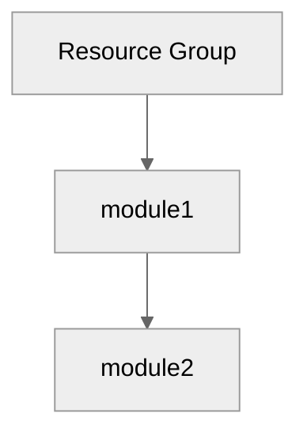

# Step 4: Implementation Plan - {project-name}

> Generated by bicep-plan agent | {date} | Artifact v{artifact-version}

## Overview

Brief description of what will be implemented.

---

## Resource Inventory

| Resource   | Type                            | SKU | Dependencies |
| ---------- | ------------------------------- | --- | ------------ |
| Resource 1 | Microsoft.Provider/resourceType |     |              |
| Resource 2 | Microsoft.Provider/resourceType |     |              |

---

## Module Structure

```
infra/bicep/{project-name}/
├── main.bicep
├── main.bicepparam
├── modules/
│   ├── policy-assignments.bicep  # Default: deploy Azure Policies from requirements
│   ├── module1.bicep
│   ├── module2.bicep
│   └── module3.bicep
└── deploy.ps1
```

<!-- Default: Greenfield - policies deployed by this project -->
<!-- Override: Brownfield - omit policy-assignments.bicep if user requests subscription scan -->

---

## Implementation Tasks

### Task 0: modules/policy-assignments.bicep

**Purpose**: Deploy Azure Policy assignments at subscription scope

**Scope**: `targetScope = 'subscription'`

**Policy Assignments**:

| #   | Policy        | Built-in ID   | Effect   | Assignment Name           |
| --- | ------------- | ------------- | -------- | ------------------------- |
| 1   | {policy-name} | {built-in-id} | {effect} | {project}-{category}-{##} |

**Parameters**: Extract from requirements `### Policy Parameters` section

**Cleanup Script**: `scripts/Remove-{project-name}Policies.ps1`

### Task 1: main.bicep (Orchestration)

**Purpose**: Main entry point

**Parameters**:

- List parameters

**Variables**:

- List variables (e.g., uniqueSuffix from uniqueString(resourceGroup().id))

**Modules Called**:

1. module1.bicep
2. module2.bicep

### Task 2: modules/module1.bicep

**Resources**:

- List resources

**Outputs**:

- List outputs

### Task 3: modules/module2.bicep

**Resources**:

- List resources

**Key Configuration**:

```bicep
Example configuration snippet
```

**Outputs**:

- List outputs

### Task N: deploy.ps1 (Deployment Script)

**Features**:

- Parameter validation
- Bicep lint/build verification
- What-If preview
- Deployment execution
- Output display

---

## Dependency Graph



---

## Naming Conventions

| Resource       | Pattern                  | Example            |
| -------------- | ------------------------ | ------------------ |
| Resource Group | rg-{project}-{env}       | rg-project-dev     |
| Resource 1     | {prefix}-{project}-{env} | prefix-project-dev |

---

## Security Configuration

| Resource   | Security Setting | Value |
| ---------- | ---------------- | ----- |
| Resource 1 | Setting 1        |       |
| Resource 2 | Setting 2        |       |

---

## Estimated Implementation Time

| Task          | Estimated Duration |
| ------------- | ------------------ |
| Bicep modules | X minutes          |
| Testing       | X minutes          |
| Deployment    | X minutes          |
| **Total**     | **~X minutes**     |

---

## Approval Gate

> **📋 Implementation Plan Ready**
>
> - X Azure resources planned
> - X Bicep modules to create
> - Governance constraints addressed
> - CAF naming conventions applied
>
> Reply **"approve"** to proceed to bicep-code, or provide feedback.

---

_Plan generated by bicep-plan agent following Azure Well-Architected Framework guidelines._
