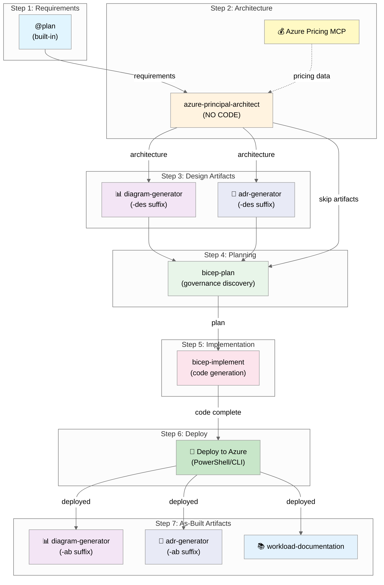

# Azure SMB Landing Zone

> **Repeatable Azure landing zone for SMB customers.** VMware-to-Azure migration ready,
> policy-enforced, CAF-aligned. Designed for Microsoft partners hosting 1000+ small business customers.

## Overview

Single-subscription Azure environment optimized for:

- **VMware-to-Azure migrations** via Azure Migrate
- **Cost-first design** - resilience traded for affordability
- **Policy-enforced security** - 20 guardrail policies included
- **Repeatable deployments** - no per-customer customization needed

Built with the [Agentic InfraOps](https://github.com/jonathan-vella/azure-agentic-infraops) workflow
using AI agents for requirements gathering, architecture assessment, and Bicep code generation.

## Architecture

```
┌─────────────────────────────────────────────────────────────┐
│                    Single Subscription                       │
├─────────────────────────────────────────────────────────────┤
│  ┌─────────────────┐    ┌─────────────────────────────────┐ │
│  │    Hub VNet     │    │          Spoke VNet             │ │
│  │                 │    │                                 │ │
│  │ • Bastion (Dev) │◄──►│ • Workload Subnets              │ │
│  │ • FW Subnet*    │    │ • NAT Gateway                   │ │
│  │ • GW Subnet*    │    │ • Baseline NSG                  │ │
│  │ • Private DNS   │    │                                 │ │
│  └─────────────────┘    └─────────────────────────────────┘ │
│           │                           │                      │
│  ┌────────┴────────┐         ┌────────┴────────┐            │
│  │   rg-hub-swc    │         │  rg-spoke-swc   │            │
│  └─────────────────┘         └─────────────────┘            │
│                                                              │
│  ┌─────────────────┐  ┌─────────────────┐  ┌──────────────┐ │
│  │  rg-migrate-swc │  │  rg-monitor-swc │  │ rg-backup-swc│ │
│  │  • Azure Migrate│  │  • Log Analytics│  │ • RSV Vault  │ │
│  └─────────────────┘  │  • Defender Free│  └──────────────┘ │
│                       └─────────────────┘                    │
└─────────────────────────────────────────────────────────────┘
                    * Optional (prompted at deploy)
```

## Quick Start

### Prerequisites

- Docker Desktop (or alternative: Podman, Colima, Rancher Desktop)
- VS Code with Dev Containers extension
- GitHub Copilot subscription
- Azure subscription with Contributor access (for deployments)

### Getting Started

```bash
# Clone repository
git clone https://github.com/jonathan-vella/azure-smb-landing-zone.git
cd azure-smb-landing-zone

# Open in VS Code
code .

# Reopen in Dev Container
# F1 → "Dev Containers: Reopen in Container"
# Wait 3-5 minutes for initial build

# Authenticate with Azure
az login
az account set --subscription "<your-subscription-id>"

# Verify tools
az bicep version && terraform version && pwsh --version
```

## Agent Workflow



## Workflow Steps

| Step | Agent/Phase     | Purpose                     | Output                          |
| ---- | --------------- | --------------------------- | ------------------------------- |
| 1    | `@requirements` | Gather infrastructure needs | `01-requirements.md`            |
| 2    | `@architect`    | WAF assessment + cost       | `02-architecture-assessment.md` |
| 3    | Design          | Diagrams + ADRs             | `03-des-*` artifacts            |
| 4    | `@bicep-plan`   | Implementation planning     | `04-implementation-plan.md`     |
| 5    | `@bicep-code`   | Bicep generation            | `infra/bicep/smb-landing-zone/` |
| 6    | `@deploy`       | Deploy to Azure             | `06-deployment-summary.md`      |
| 7    | As-Built        | Final documentation         | `07-*` docs                     |

**Usage:** `Ctrl+Shift+A` → Select agent → Use prompt from `.github/prompts/plan-smb-landing-zone.prompt.md`

## Included Resources

### Always Deployed

| Resource                | Resource Group | Configuration                |
| ----------------------- | -------------- | ---------------------------- |
| Hub VNet                | rg-hub         | Pre-provisioned subnets      |
| Spoke VNet              | rg-spoke       | Workload subnets + NSG       |
| NAT Gateway             | rg-spoke       | Outbound internet            |
| Azure Bastion Developer | rg-hub         | Secure VM access             |
| Azure Private DNS       | rg-hub         | Auto-registration            |
| Azure Migrate Project   | rg-migrate     | VMware assessment            |
| Log Analytics Workspace | rg-monitor     | 500 MB/day, 30-day retention |
| Recovery Services Vault | rg-backup      | VM backup                    |
| Cost Management Budget  | subscription   | $500/month + alerts          |
| Defender for Cloud      | subscription   | Free tier                    |

### Deployment Scenarios

| Scenario   | Firewall | VPN | NAT GW | Peering | UDR | Monthly Cost |
| ---------- | :------: | :-: | :----: | :-----: | :-: | -----------: |
| `baseline` |    ❌    | ❌  |   ✅   |   ❌    | ❌  |         ~$48 |
| `firewall` |    ✅    | ❌  |   ❌   |   ✅    | ✅  |        ~$336 |
| `vpn`      |    ❌    | ✅  |   ❌   |   ✅    | ❌  |        ~$187 |
| `full`     |    ✅    | ✅  |   ❌   |   ✅    | ✅  |        ~$476 |

## Azure Policy (20 Guardrails)

| Category   | Policies                                                |
| ---------- | ------------------------------------------------------- |
| Compute    | Allowed SKUs (B/D/E only), no public IPs, managed disks |
| Network    | NSG required, management ports closed, no IP forwarding |
| Storage    | HTTPS only, no public blob, TLS 1.2+                    |
| Identity   | Azure AD-only SQL, no classic resources                 |
| Compliance | Required tags, allowed locations, backup audit          |

## Project Structure

```
├── .devcontainer/              # Dev container configuration
├── .github/
│   ├── agents/                 # Copilot agents (requirements, architect, bicep-*, deploy)
│   ├── instructions/           # AI coding standards
│   ├── prompts/
│   │   └── plan-smb-landing-zone.prompt.md  # ⭐ Main prompt
│   └── templates/              # Artifact output templates
├── agent-output/
│   └── smb-landing-zone/       # Generated artifacts for this project
├── infra/bicep/
│   └── smb-landing-zone/       # Bicep templates (generated by agents)
└── mcp/azure-pricing-mcp/      # Azure Pricing MCP server
```

## Key Design Decisions

| Decision          | Choice                            | Rationale                    |
| ----------------- | --------------------------------- | ---------------------------- |
| Resilience        | Not required                      | Cost priority for SMB        |
| SLA/RTO/RPO       | N/A                               | Rebuild from Bicep if needed |
| VM Access         | Azure Bastion Developer           | No public IPs on VMs         |
| Outbound Internet | NAT Gateway                       | Default outbound deprecated  |
| DNS               | Azure Private DNS                 | Auto-registration for VMs    |
| Regions           | swedencentral, germanywestcentral | EU GDPR compliant            |
| Tags              | Environment, Owner (required)     | CAF-aligned tagging          |

## Deployment

```powershell
cd infra/bicep/smb-landing-zone

# Baseline: NAT Gateway only (~$48/mo)
./deploy.ps1 -Scenario baseline

# Firewall: Azure Firewall + UDR (~$336/mo)
./deploy.ps1 -Scenario firewall

# VPN: VPN Gateway + Gateway Transit (~$187/mo)
./deploy.ps1 -Scenario vpn

# Full: Firewall + VPN + UDR (~$476/mo)
./deploy.ps1 -Scenario full
```

See [Scenario Architecture Diagrams](agent-output/smb-landing-zone/) for visual reference.

## Documentation

- [SMB Landing Zone Prompt](.github/prompts/plan-smb-landing-zone.prompt.md) - Main requirements prompt
- [Copilot Instructions](.github/copilot-instructions.md) - Agent workflow guide
- [Infrastructure Template](.github/templates/01-requirements-infrastructure.template.md) - Requirements template

## Development

### Prerequisites

- Docker Desktop (or Podman/Colima/Rancher Desktop)
- VS Code with Dev Containers + GitHub Copilot extensions
- Azure subscription with Contributor access

### Getting Started

```bash
# Clone and open in VS Code
git clone https://github.com/jonathan-vella/azure-smb-landing-zone.git
cd azure-smb-landing-zone
code .

# Reopen in Dev Container (F1 → "Dev Containers: Reopen in Container")
# Wait 3-5 minutes for initial build

# Authenticate
az login
az account set --subscription "<your-subscription-id>"
```

### Generate Landing Zone

1. Press `Ctrl+Shift+A` → Select `@requirements`
2. Paste content from `.github/prompts/plan-smb-landing-zone.prompt.md`
3. Follow agent workflow through to deployment

### Validation Commands

```bash
# Bicep
bicep build infra/bicep/{project}/main.bicep
bicep lint infra/bicep/{project}/main.bicep

# Markdown
npm run lint:md
```

### Deployment Commands

```powershell
cd infra/bicep/smb-landing-zone
./deploy.ps1 -Scenario baseline -WhatIf  # Preview changes
./deploy.ps1 -Scenario firewall          # Deploy with Firewall
```

## Contributing

1. Create a feature branch
2. Make your changes
3. Run `npm run lint:md` to validate markdown
4. Submit a pull request

## Additional Resources

- [Agentic InfraOps Framework](https://github.com/jonathan-vella/azure-agentic-infraops) - Parent framework
- [Azure Landing Zones](https://aka.ms/alz) - Microsoft reference architectures
- [Azure Verified Modules](https://aka.ms/avm) - Bicep module registry
- [Cloud Adoption Framework](https://aka.ms/caf) - Naming and governance standards

## Target Audience

This landing zone is designed for:

- **Microsoft Partners** hosting SMB customers on VMware
- **Managed Service Providers** standardizing Azure onboarding
- **IT Consultants** delivering repeatable migration projects

## License

[MIT](LICENSE)
