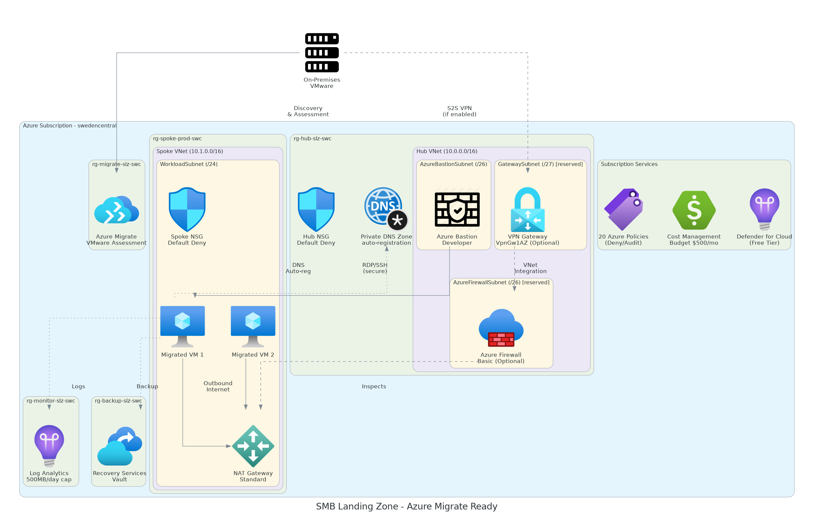

<!-- markdownlint-disable MD013 MD033 MD041 -->

<a id="readme-top"></a>

<!-- PROJECT SHIELDS -->

[![Contributors][contributors-shield]][contributors-url]
[![Forks][forks-shield]][forks-url]
[![Stargazers][stars-shield]][stars-url]
[![Issues][issues-shield]][issues-url]
[![MIT License][license-shield]][license-url]
[![Azure][azure-shield]][azure-url]

<!-- PROJECT LOGO -->
<br />
<div align="center">
  <a href="https://github.com/jonathan-vella/azure-smb-rf">
    
  </a>

  <h1 align="center">Azure SMB Ready Foundations</h1>

  <p align="center">
    <strong>Repeatable Azure SMB Ready Foundations for SMB customers.</strong>
    <br />
    On-premises migration ready • Policy-enforced • Security-hardened
    <br />
    <br />
    <a href="#-quick-start"><strong>Quick Start »</strong></a>
    ·
    <a href="agent-output/smb-ready-foundation/">View Artifacts</a>
    ·
    <a href="https://github.com/jonathan-vella/azure-smb-rf/issues/new?labels=bug">Report Bug</a>
    ·
    <a href="https://github.com/jonathan-vella/azure-smb-rf/issues/new?labels=enhancement">Request Feature</a>
  </p>
</div>

<!-- TABLE OF CONTENTS -->
<details>
  <summary>📑 Table of Contents</summary>
  <ol>
    <li><a href="#-about-the-project">About The Project</a></li>
    <li><a href="#-architecture">Architecture</a></li>
    <li><a href="#-deployment-scenarios">Deployment Scenarios</a></li>
    <li><a href="#-quick-start">Quick Start</a></li>
    <li><a href="#-included-resources">Included Resources</a></li>
    <li><a href="#-azure-policy-guardrails">Azure Policy Guardrails</a></li>
    <li><a href="#-project-structure">Project Structure</a></li>
    <li><a href="#-key-design-decisions">Key Design Decisions</a></li>
    <li><a href="#-development">Development</a></li>
    <li><a href="#-target-audience">Target Audience</a></li>
    <li><a href="#-additional-resources">Additional Resources</a></li>
    <li><a href="#-contributing">Contributing</a></li>
    <li><a href="#-license">License</a></li>
  </ol>
</details>

---

## 🚀 About The Project

Single-subscription Azure environment designed for **Microsoft Partners** migrating small
business customers from on-premises infrastructure to Azure at scale.

<div align="center">

| ✅ On-premises migrations |        ✅ Cost-first design         | ✅ Policy-enforced security |   ✅ Repeatable deployments   |
| :-----------------------: | :---------------------------------: | :-------------------------: | :---------------------------: |
|     Via Azure Migrate     | Resilience traded for affordability |    20 guardrail policies    | No per-customer customization |

</div>

Built using the [APEX](https://github.com/jonathan-vella/azure-agentic-infraops) toolkit —
an AI-agent workflow for requirements gathering, architecture assessment, and Bicep code generation.
Azure SMB Ready Foundations is a ready-to-deploy output of that toolkit, not the toolkit itself.

### 🛠️ Built With

[![Bicep][bicep-shield]][bicep-url]
[![PowerShell][powershell-shield]][powershell-url]
[![Azure CLI][azcli-shield]][azcli-url]
[![GitHub Copilot][copilot-shield]][copilot-url]
[![Dev Containers][devcontainer-shield]][devcontainer-url]

<p align="right">(<a href="#readme-top">back to top</a>)</p>

---

## 🏗️ Architecture

<div align="center">
  
  <br />
  <em>Complete architecture with all optional components (Firewall, VPN Gateway)</em>
</div>

<br />

Azure SMB Ready Foundations follows a **hub-and-spoke** topology within a single subscription,
governed by a dedicated **management group** for policy inheritance:

### Management Group Hierarchy

```text
Tenant Root Group
└── smb-rf (SMB Ready Foundation)
    └── Customer Subscription
```

| Component             | Purpose                                                            |
| --------------------- | ------------------------------------------------------------------ |
| **Management Group**  | `smb-rf` — 30 Azure Policies scoped at MG level                    |
| **Hub VNet**          | Centralized services (Bastion, Firewall, VPN Gateway, Private DNS) |
| **Spoke VNet**        | Workload hosting with NAT Gateway for outbound internet            |
| **Azure Migrate**     | Server discovery and assessment                                    |
| **Log Analytics**     | Centralized monitoring with 500 MB/day cap                         |
| **Recovery Services** | VM backup with default policy                                      |

<p align="right">(<a href="#readme-top">back to top</a>)</p>

---

## 💰 Deployment Scenarios

Choose the scenario that fits your budget and connectivity requirements:

<div align="center">

|    Scenario    | Firewall | VPN | NAT GW | Peering | UDR | Deploy Time | Monthly Cost |
| :------------: | :------: | :-: | :----: | :-----: | :-: | :---------: | -----------: |
| **`baseline`** |    ❌    | ❌  |   ✅   |   ❌    | ❌  |   ~4 min    |     **~$48** |
| **`firewall`** |    ✅    | ❌  |   ❌   |   ✅    | ✅  |   ~15 min   |    **~$336** |
|   **`vpn`**    |    ❌    | ✅  |   ❌   |   ✅    | ❌  |   ~25 min   |    **~$187** |
|   **`full`**   |    ✅    | ✅  |   ❌   |   ✅    | ✅  | ~40-55 min  |    **~$476** |

</div>

> 💡 **Tip:** Start with `baseline` for testing, upgrade to `firewall` or `full` for production
> workloads requiring traffic inspection or hybrid connectivity.

<p align="right">(<a href="#readme-top">back to top</a>)</p>

---

## ⚡ Quick Start

### Prerequisites

- 🐳 Docker Desktop (or Podman, Colima, Rancher Desktop)
- 💻 VS Code with [Dev Containers](https://marketplace.visualstudio.com/items?itemName=ms-vscode-remote.remote-containers) extension
- 🤖 GitHub Copilot subscription
- ☁️ Azure subscription with Owner access
- 🔑 Global Administrator or Tenant Root access (for Phase 0 — management group permissions)

### 1️⃣ Clone and Open

```bash
git clone https://github.com/jonathan-vella/azure-smb-rf.git
cd azure-smb-rf
code .
```

### 2️⃣ Start Dev Container

Press `F1` → **Dev Containers: Reopen in Container**

> ⏱️ First build takes 3-5 minutes

### 3️⃣ Authenticate with Azure

```bash
az login
az account set --subscription "<your-subscription-id>"
```

### 4️⃣ Phase 0: Management Group Permissions (one-time)

```powershell
cd scripts
./Setup-ManagementGroupPermissions.ps1
```

> Grants the deploying identity **Management Group Contributor** and **Resource Policy Contributor**
> on the tenant root. Requires Global Administrator. Only needed once per tenant.

### 5️⃣ Phase 1: Management Group + MG Policies

```powershell
cd infra/bicep/smb-ready-foundation
./deploy-mg.ps1 -Scenario baseline
```

> Creates the `smb-rf` management group under tenant root, moves the subscription under it,
> and deploys 30 policies at management group scope.

### 6️⃣ Phase 2: Subscription Infrastructure

```powershell
# Preview changes (What-If)
./deploy.ps1 -Scenario baseline -WhatIf

# Deploy baseline (~$48/mo)
./deploy.ps1 -Scenario baseline

# Deploy with firewall (~$336/mo)
./deploy.ps1 -Scenario firewall

# Deploy full scenario (~$476/mo)
./deploy.ps1 -Scenario full
```

### 7️⃣ Cleanup (Optional)

When you're done testing, remove all deployed resources:

```powershell
cd infra/bicep/smb-ready-foundation/scripts

# Phase 0: Remove MG-scoped policies
./Remove-SmbReadyFoundation.ps1 -Location swedencentral -WhatIf

# Full cleanup (subscription resources + optionally remove management group)
./Remove-SmbReadyFoundation.ps1 -Location swedencentral -Force
./Remove-SmbReadyFoundation.ps1 -Location swedencentral -Force -RemoveManagementGroup
```

> ⏱️ Cleanup takes 10-15 minutes (Azure Firewall and VPN Gateway take longest to delete)

<p align="right">(<a href="#readme-top">back to top</a>)</p>

---

## 📦 Included Resources

### Always Deployed

| Resource                   | Resource Group | Configuration                |
| -------------------------- | -------------- | ---------------------------- |
| 🌐 Hub VNet                | `rg-hub`       | Pre-provisioned subnets      |
| 🌐 Spoke VNet              | `rg-spoke`     | Workload subnets + NSG       |
| 🚪 NAT Gateway             | `rg-spoke`     | Outbound internet            |
| 🔐 Azure Bastion Developer | `rg-hub`       | Secure VM access             |
| 🔗 Azure Private DNS       | `rg-hub`       | Auto-registration            |
| 📦 Azure Migrate Project   | `rg-migrate`   | Server assessment            |
| 📊 Log Analytics Workspace | `rg-monitor`   | 500 MB/day, 30-day retention |
| 💾 Recovery Services Vault | `rg-backup`    | VM backup                    |
| 💰 Cost Management Budget  | subscription   | $500/month + alerts          |
| 🛡️ Defender for Cloud      | subscription   | Free tier                    |

<p align="right">(<a href="#readme-top">back to top</a>)</p>

---

## 🛡️ Azure Policy Guardrails

34 policies split across management group and subscription scopes:

| Scope                | Count | Examples                                                 |
| -------------------- | ----- | -------------------------------------------------------- |
| **Management Group** | 30    | Allowed SKUs, no public IPs, HTTPS only, TLS 1.2+, tags  |
| **Subscription**     | 3+1   | Backup auto-enroll (DeployIfNotExists), budget, Defender |

| Category       | Policies                                                |
| -------------- | ------------------------------------------------------- |
| **Compute**    | Allowed SKUs (B/D/E only), no public IPs, managed disks |
| **Network**    | NSG required, management ports closed, no IP forwarding |
| **Storage**    | HTTPS only, no public blob, TLS 1.2+                    |
| **Identity**   | Azure AD-only SQL, no classic resources                 |
| **Compliance** | Required tags, allowed locations, backup audit          |

<p align="right">(<a href="#readme-top">back to top</a>)</p>

---

## 📁 Project Structure

```
├── 📁 .devcontainer/          # Dev container configuration
├── 📁 .github/
│   ├── 📁 agents/             # Copilot agents (requirements, architect, bicep-*, deploy)
│   ├── 📁 instructions/       # AI coding standards
│   ├── 📁 prompts/
│   │   └── 📄 plan-smb-ready-foundation.prompt.md  # ⭐ Main prompt
│   └── 📁 templates/          # Artifact output templates
├── 📁 agent-output/
│   └── 📁 smb-ready-foundation/   # Generated artifacts for this project
├── 📁 docs/
│   └── 📁 images/             # Architecture diagrams
├── 📁 infra/bicep/
│   └── 📁 smb-ready-foundation/   # Bicep templates (generated by agents)
│       ├── 📄 deploy-mg.bicep     # Management group deployment template
│       ├── 📄 deploy-mg.ps1       # MG deployment orchestration script
│       └── 📁 modules/
│           └── 📄 policy-assignments-mg.bicep  # 30 MG-scoped policy assignments
├── 📁 scripts/
│   └── 📄 Setup-ManagementGroupPermissions.ps1  # Phase 0: MG permission setup
└── 📁 mcp/azure-pricing-mcp/  # Azure Pricing MCP server
```

<p align="right">(<a href="#readme-top">back to top</a>)</p>

---

## 🎯 Key Design Decisions

| Decision              | Choice                            | Rationale                               |
| --------------------- | --------------------------------- | --------------------------------------- |
| **Management Group**  | `smb-rf` under tenant root        | Policy inheritance across subscriptions |
| **Policy Scope**      | 30 MG-scoped + 3+1 sub-scoped     | MG for guardrails, sub for DINE/budget  |
| **Resilience**        | Not required                      | Cost priority for SMB                   |
| **SLA/RTO/RPO**       | N/A                               | Rebuild from Bicep if needed            |
| **VM Access**         | Azure Bastion Developer           | No public IPs on VMs                    |
| **Outbound Internet** | NAT Gateway                       | Default outbound deprecated             |
| **DNS**               | Azure Private DNS                 | Auto-registration for VMs               |
| **Regions**           | swedencentral, germanywestcentral | EU GDPR compliant                       |
| **Tags**              | Environment, Owner (required)     | Consistent tagging standard             |

<p align="right">(<a href="#readme-top">back to top</a>)</p>

---

## 🔧 Development

### Generate Azure SMB Ready Foundations with Agents

1. Press `Ctrl+Shift+A` → Select `@requirements`
2. Paste content from `.github/prompts/plan-smb-ready-foundation.prompt.md`
3. Follow agent workflow through to deployment

### Validation Commands

```bash
# Bicep lint
bicep lint infra/bicep/smb-ready-foundation/*.bicep

# Markdown lint
npm run lint:md

# Build Bicep
bicep build infra/bicep/smb-ready-foundation/main.bicep
```

<p align="right">(<a href="#readme-top">back to top</a>)</p>

---

## 🎯 Target Audience

Azure SMB Ready Foundations is designed for:

- 🏢 **Microsoft Partners** hosting SMB customers on on-premises infrastructure
- 🔧 **Managed Service Providers** standardizing Azure onboarding
- 💼 **IT Consultants** delivering repeatable migration projects

<p align="right">(<a href="#readme-top">back to top</a>)</p>

---

## 📚 Additional Resources

| Resource                                                                               | Description                                   |
| -------------------------------------------------------------------------------------- | --------------------------------------------- |
| [Partner Quick Reference](docs/partner-quick-reference.md)                             | One-page deployment guide for partners        |
| [APEX Toolkit](https://github.com/jonathan-vella/azure-agentic-infraops) | AI-agent toolkit for Azure platform engineering |
| [Azure Verified Modules](https://aka.ms/avm)                                           | Bicep module registry                         |

<p align="right">(<a href="#readme-top">back to top</a>)</p>

---

## 🤝 Contributing

Contributions are welcome! Here's how:

1. 🍴 Fork the Project
2. 🌿 Create your Feature Branch (`git checkout -b feature/AmazingFeature`)
3. 💾 Commit your Changes using [Conventional Commits](https://www.conventionalcommits.org/) (`git commit -m 'feat: add bastion subnet option'`)
4. 📤 Push to the Branch (`git push origin feature/AmazingFeature`)
5. 🔃 Open a Pull Request (PR template will guide you)

See [CONTRIBUTING.md](CONTRIBUTING.md) for detailed guidelines.

Don't forget to give the project a ⭐ if you found it useful!

<p align="right">(<a href="#readme-top">back to top</a>)</p>

---

## 📄 License

Distributed under the MIT License. See [LICENSE](LICENSE) for more information.

<p align="right">(<a href="#readme-top">back to top</a>)</p>

---

<div align="center">
  <p>
    Made with ❤️ by <a href="https://github.com/jonathan-vella">Jonathan Vella</a>
  </p>
  <p>
    <a href="https://github.com/jonathan-vella/azure-smb-rf">
      
    </a>
  </p>
</div>

<!-- MARKDOWN LINKS & IMAGES -->
<!-- https://www.markdownguide.org/basic-syntax/#reference-style-links -->

[contributors-shield]: https://img.shields.io/github/contributors/jonathan-vella/azure-smb-rf.svg?style=for-the-badge
[contributors-url]: https://github.com/jonathan-vella/azure-smb-rf/graphs/contributors
[forks-shield]: https://img.shields.io/github/forks/jonathan-vella/azure-smb-rf.svg?style=for-the-badge
[forks-url]: https://github.com/jonathan-vella/azure-smb-rf/network/members
[stars-shield]: https://img.shields.io/github/stars/jonathan-vella/azure-smb-rf.svg?style=for-the-badge
[stars-url]: https://github.com/jonathan-vella/azure-smb-rf/stargazers
[issues-shield]: https://img.shields.io/github/issues/jonathan-vella/azure-smb-rf.svg?style=for-the-badge
[issues-url]: https://github.com/jonathan-vella/azure-smb-rf/issues
[license-shield]: https://img.shields.io/github/license/jonathan-vella/azure-smb-rf.svg?style=for-the-badge
[license-url]: https://github.com/jonathan-vella/azure-smb-rf/blob/main/LICENSE
[azure-shield]: https://img.shields.io/badge/Azure-Ready-0078D4?style=for-the-badge&logo=microsoftazure&logoColor=white
[azure-url]: https://azure.microsoft.com

<!-- TECH STACK BADGES -->

[bicep-shield]: https://img.shields.io/badge/Bicep-0.20+-00A4EF?style=for-the-badge&logo=azurefunctions&logoColor=white
[bicep-url]: https://learn.microsoft.com/azure/azure-resource-manager/bicep/
[powershell-shield]: https://img.shields.io/badge/PowerShell-7+-5391FE?style=for-the-badge&logo=powershell&logoColor=white
[powershell-url]: https://learn.microsoft.com/powershell/
[azcli-shield]: https://img.shields.io/badge/Azure_CLI-2.50+-0078D4?style=for-the-badge&logo=microsoftazure&logoColor=white
[azcli-url]: https://learn.microsoft.com/cli/azure/
[copilot-shield]: https://img.shields.io/badge/GitHub_Copilot-Enabled-000000?style=for-the-badge&logo=github&logoColor=white
[copilot-url]: https://github.com/features/copilot
[devcontainer-shield]: https://img.shields.io/badge/Dev_Containers-Ready-007ACC?style=for-the-badge&logo=docker&logoColor=white
[devcontainer-url]: https://containers.dev/
