# Agentic InfraOps Template

> **Azure infrastructure engineered by AI agents.** Template with custom Copilot agents, Dev Container,
> and workflow automation.

## Overview

Starter template for agentic Azure infrastructure development. Contains custom Copilot agents
(architect, bicep-plan, bicep-implement), Azure Pricing MCP server, and the 7-step workflow.

This template auto-syncs weekly from [azure-agentic-infraops](https://github.com/jonathan-vella/azure-agentic-infraops).

## Quick Start

### Prerequisites

- Docker Desktop (or alternative: Podman, Colima, Rancher Desktop)
- VS Code with Dev Containers extension
- GitHub Copilot subscription
- Azure subscription with Contributor access (for deployments)

### Getting Started

```bash
# Clone repository
git clone https://github.com/jonathan-vella/azure-agentic-infraops-accelerator.git
cd azure-agentic-infraops-accelerator

# Open in VS Code
code .

# Reopen in Dev Container
# F1 → "Dev Containers: Reopen in Container"
# Wait 3-5 minutes for initial build

# Authenticate with Azure
az login
az account set --subscription "<your-subscription-id>"

# Verify tools
az bicep version && terraform version && pwsh --version
```

## Agent Workflow

```mermaid
%%{init: {'theme':'neutral'}}%%
graph TB
    subgraph "Step 1: Requirements"
        P["@plan<br/>(built-in)"]
    end

    subgraph "Step 2: Architecture"
        A["azure-principal-architect<br/>(NO CODE)"]
        MCP["💰 Azure Pricing MCP"]
    end

    subgraph "Step 3: Design Artifacts"
        D["📊 diagram-generator<br/>(-des suffix)"]
        ADR1["📝 adr-generator<br/>(-des suffix)"]
    end

    subgraph "Step 4: Planning"
        B["bicep-plan<br/>(governance discovery)"]
    end

    subgraph "Step 5: Implementation"
        I["bicep-implement<br/>(code generation)"]
    end

    subgraph "Step 6: Deploy"
        DEP["🚀 Deploy to Azure<br/>(PowerShell/CLI)"]
    end

    subgraph "Step 7: As-Built Artifacts"
        D2["📊 diagram-generator<br/>(-ab suffix)"]
        ADR2["📝 adr-generator<br/>(-ab suffix)"]
        WL["📚 workload-documentation"]
    end

    P -->|"requirements"| A
    MCP -.->|"pricing data"| A
    A -->|"architecture"| D
    A -->|"architecture"| ADR1
    D --> B
    ADR1 --> B
    A -->|"skip artifacts"| B
    B -->|"plan"| I
    I -->|"code complete"| DEP
    DEP -->|"deployed"| D2
    DEP -->|"deployed"| ADR2
    DEP -->|"deployed"| WL

    style P fill:#e1f5fe
    style A fill:#fff3e0
    style MCP fill:#fff9c4
    style D fill:#f3e5f5
    style ADR1 fill:#e8eaf6
    style B fill:#e8f5e9
    style I fill:#fce4ec
    style DEP fill:#c8e6c9
    style D2 fill:#f3e5f5
    style ADR2 fill:#e8eaf6
    style WL fill:#e3f2fd
```



## Workflow Steps

| Step | Agent/Phase                 | Purpose                              | Creates                                   | Required |
| ---- | --------------------------- | ------------------------------------ | ----------------------------------------- | -------- |
| 1    | `@plan` (built-in)          | Gather requirements                  | `01-requirements.md`                      | ✅ Yes   |
| 2    | `azure-principal-architect` | WAF assessment                       | `02-architecture-assessment.md`           | ✅ Yes   |
| 3    | Design Artifacts            | Visualize design, document decisions | `03-des-*` diagrams + cost + ADRs         | Optional |
| 4    | `bicep-plan`                | Implementation planning + governance | `04-*` plan + governance constraints      | ✅ Yes   |
| 5    | `bicep-implement`           | Code generation                      | Bicep templates + `05-*` reference        | ✅ Yes   |
| 6    | Deploy                      | Deploy to Azure                      | `06-deployment-summary.md`                | ✅ Yes   |
| 7    | As-Built Artifacts          | Document final state                 | `07-ab-*` diagrams + ADRs + workload docs | Optional |

**Usage:** Press `Ctrl+Shift+A` in VS Code to select an agent.

## Project Structure

```
├── .devcontainer/           # Dev container configuration
├── .github/
│   ├── agents/              # Copilot agents
│   ├── instructions/        # AI coding standards
│   ├── prompts/             # Reusable prompt templates
│   ├── templates/           # Artifact output templates
│   └── copilot-instructions.md
├── agent-output/            # Agent-generated artifacts
├── infra/bicep/             # Bicep templates
└── mcp/azure-pricing-mcp/   # Azure Pricing MCP server
```

## Documentation

- [Copilot Instructions](.github/copilot-instructions.md)
- [Main Repository Docs](https://github.com/jonathan-vella/azure-agentic-infraops/tree/main/docs)
- [Workflow Guide](https://github.com/jonathan-vella/azure-agentic-infraops/blob/main/docs/reference/workflow.md)

## Development

### Validation Commands

```bash
# Bicep
bicep build infra/bicep/{project}/main.bicep
bicep lint infra/bicep/{project}/main.bicep

# Markdown
npm run lint:md
```

### Deployment

```powershell
cd infra/bicep/{project}
./deploy.ps1 -WhatIf  # Preview changes
./deploy.ps1          # Deploy
```

## Contributing

1. Create a feature branch
2. Make your changes
3. Run `npm run lint:md` to validate markdown
4. Submit a pull request

## Additional Resources

For advanced usage, reference implementations, or additional documentation, see the main repository:
[azure-agentic-infraops](https://github.com/jonathan-vella/azure-agentic-infraops)

## License

[MIT](LICENSE)
