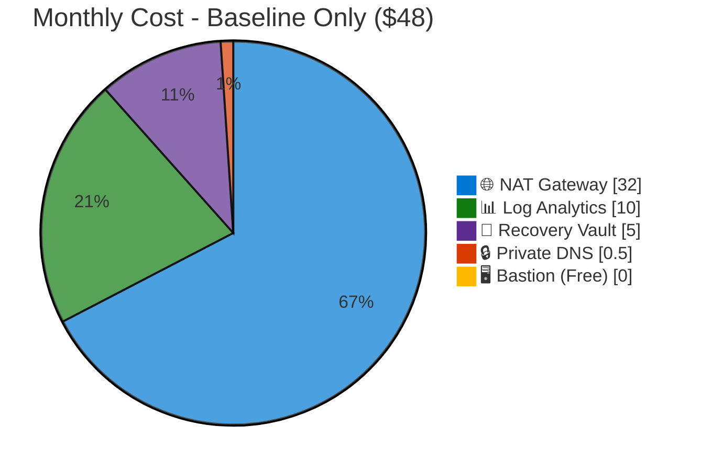
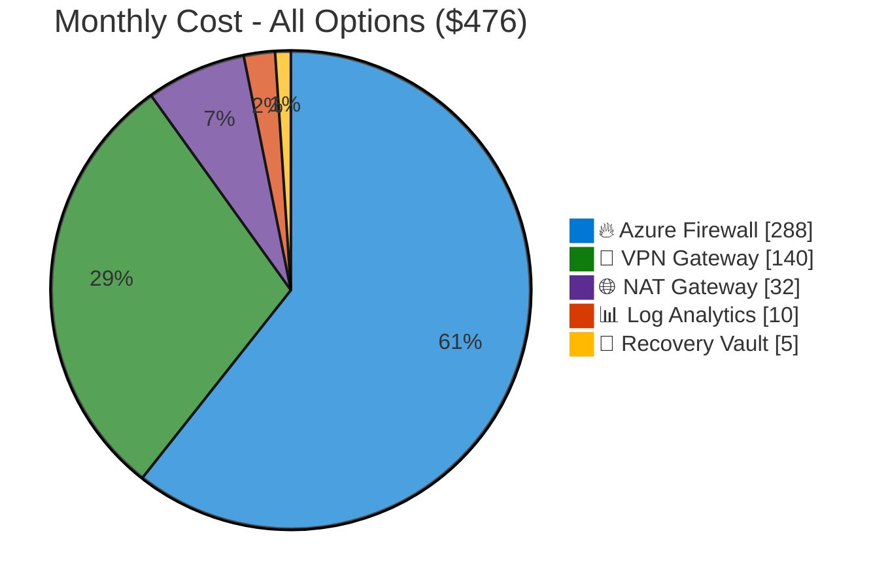

# Azure Cost Estimate: SMB Landing Zone

**Generated**: 2026-01-27  
**Artifact Version**: 0.1  
**Region**: swedencentral  
**Environment**: Production  
**MCP Tools Used**: azure_cost_estimate, azure_price_compare, azure_documentation  
**Architecture Reference**: [02-architecture-assessment.md](02-architecture-assessment.md)

## 💰 Cost At-a-Glance

> **Monthly Total: ~$48 - $476** | Annual: ~$576 - $5,712
>
> ```
> Budget: $500/month (hard cap) | Utilization: 10-95% ($48-$476 of $500)
> ```
>
> | Status            | Indicator                                               |
> | ----------------- | ------------------------------------------------------- |
> | Cost Trend        | ➡️ Stable (fixed infrastructure, variable VM workloads) |
> | Savings Available | 💰 ~$1,656/year with Bastion Developer vs Basic         |
> | Compliance        | ✅ EU GDPR via swedencentral region                     |

## ✅ Decision Summary

- ✅ **Approved**: Baseline infrastructure (~$48/mo) with all required services
- ⏳ **Deferred**: Azure Firewall (+$288/mo), VPN Gateway VpnGw1AZ (+$140/mo) - deploy on demand
- 🔁 **Redesign Trigger**: SLA requirement > 99.9% forces zone-redundant SKUs

**Confidence**: High | **Expected Variance**: ±15% (NAT Gateway data processing varies by workload)

## 🔁 Requirements → Cost Mapping

| Requirement         | Architecture Decision                               | Cost Impact               | Mandatory |
| ------------------- | --------------------------------------------------- | ------------------------- | --------- |
| No SLA/resilience   | Single-zone deployment, no zone-redundant SKUs      | -$100+/month savings      | Yes       |
| Cost < $500/month   | Bastion Developer, Log Analytics cap, Free Defender | Enables budget compliance | Yes       |
| Secure VM access    | Azure Bastion Developer                             | $0/month                  | Yes       |
| Outbound internet   | NAT Gateway Standard                                | +$32/month                | Yes       |
| Hybrid connectivity | VPN Gateway VpnGw1AZ (optional)                     | +$140/month               | No        |
| Network inspection  | Azure Firewall Basic (optional)                     | +$288/month               | No        |

## 📊 Top 5 Cost Drivers

| Rank | Resource                        | Monthly Cost | % of Total | Trend               |
| ---- | ------------------------------- | ------------ | ---------- | ------------------- |
| 1️⃣   | Azure Firewall Basic (optional) | $288         | 67%        | ➡️ Fixed            |
| 2️⃣   | VPN Gateway VpnGw1AZ (optional) | $140         | 33%        | ➡️ Fixed            |
| 3️⃣   | NAT Gateway Standard            | $32          | 7%         | 📈 Data-dependent   |
| 4️⃣   | Log Analytics Ingestion         | $10          | 2%         | ➡️ Capped           |
| 5️⃣   | Recovery Services Vault         | $5           | 1%         | 📈 Backup-dependent |

> 💡 **Quick Win**: Deploy without Azure Firewall and VPN Gateway initially. Add only when hybrid connectivity is required. **Saves $315/month** until needed.

## Architecture Overview

### Cost Distribution





### Key Design Decisions Affecting Cost

| Decision                   | Cost Impact      | Business Rationale                               | Status   |
| -------------------------- | ---------------- | ------------------------------------------------ | -------- |
| Bastion Developer vs Basic | -$138/month 📉   | Free tier sufficient for single-admin SMB access | Required |
| No zone redundancy         | -$100+/month 📉  | Cost priority; accept single-zone risk           | Required |
| Log Analytics 500MB cap    | Prevents overrun | Protects against surprise ingestion bills        | Required |
| Defender Free tier         | -$15/VM/month 📉 | Basic CSPM without per-VM cost                   | Required |
| Firewall/VPN optional      | -$315/month 📉   | Deploy only when hybrid connectivity needed      | Optional |

## 🧾 What We Are Not Paying For (Yet)

- ❌ **Zone redundancy** - Requires premium SKUs (+$100+/month)
- ❌ **Azure Firewall** - Deploy when network inspection required (+$288/month)
- ❌ **VPN Gateway** - Deploy when on-premises connectivity required (+$140/month with VpnGw1AZ)
- ❌ **Private endpoints** - Not needed for baseline; add for PaaS integration
- ❌ **Defender for Servers** - Free tier only; add for advanced threat protection (+$15/VM/month)
- ❌ **Application Gateway/WAF** - Not in scope; add for web workloads

### Assumptions & Uncertainty

- NAT Gateway data processing: Assumed minimal (<10 GB/month) for baseline estimate
- Log Analytics ingestion: Assumed ~500MB/day (capped) = ~15GB/month
- Recovery Services: Vault base cost only; VM backup storage varies by workload
- VMs not included: Customer workloads priced separately post-migration

## ⚠️ Cost Risk Indicators

| Resource          | Risk Level | Issue                                               | Mitigation                                         |
| ----------------- | ---------- | --------------------------------------------------- | -------------------------------------------------- |
| NAT Gateway       | 🟡 Medium  | Data processing charges scale with outbound traffic | Monitor data processed; implement egress controls  |
| Log Analytics     | 🟢 Low     | Daily cap prevents overrun                          | 500MB/day cap configured; alerts at 80%            |
| Recovery Services | 🟡 Medium  | Backup storage grows over time                      | Implement retention policies; archive to cool tier |
| Azure Firewall    | 🟢 Low     | Fixed hourly cost                                   | Deploy only when required                          |

> **⚠️ Watch Item**: NAT Gateway data processing could exceed baseline if workloads have high outbound traffic. Monitor monthly.

## 🎯 Quick Decision Matrix

_"If you need X, expect to pay Y more"_

| Requirement                 | Additional Cost | SKU Change                        | Notes                                        |
| --------------------------- | --------------- | --------------------------------- | -------------------------------------------- |
| Hybrid VPN connectivity     | +$140/month     | Add VPN Gateway VpnGw1AZ          | 650 Mbps; max 30 S2S tunnels; zone-redundant |
| Network traffic inspection  | +$288/month     | Add Azure Firewall Basic          | Required for compliance/security             |
| Zone redundancy             | +$50-150/month  | Upgrade NAT Gateway to StandardV2 | Requires architecture review                 |
| Concurrent Bastion sessions | +$138/month     | Upgrade Bastion to Basic          | Developer supports 1 connection only         |
| Advanced threat protection  | +$15/VM/month   | Defender for Servers P1           | Per-VM pricing                               |
| Higher VPN throughput       | +$140/month     | Upgrade to VpnGw2AZ               | 1 Gbps vs 650 Mbps; zone-redundant           |

## 💰 Savings Opportunities

> ### Total Potential Savings: ~$1,656/year
>
> | Optimization                 | Monthly Savings | Annual Savings   |
> | ---------------------------- | --------------- | ---------------- |
> | Bastion Developer vs Basic   | $138            | $1,656           |
> | Defender Free vs P1 (per VM) | $15/VM          | $180/VM          |
> | Log Analytics daily cap      | Variable        | Prevents overrun |

**Reservation Opportunities:**

| Service        | 1-Year Reserved | 3-Year Reserved | Notes                              |
| -------------- | --------------- | --------------- | ---------------------------------- |
| Azure Firewall | ~15% savings    | ~25% savings    | Only if committed to long-term use |
| VPN Gateway    | ~15% savings    | ~25% savings    | Only if committed to long-term use |

## Detailed Cost Breakdown

### Assumptions

- Hours: 730 hours/month
- Network egress: Minimal (<10 GB/month) for infrastructure baseline
- Storage growth: Not applicable to baseline (VM workloads separate)
- Region: swedencentral (EU pricing)

### Line Items - Required Services (Always Deployed)

| Category      | Service                 | SKU / Meter               | Quantity / Units      | Est. Monthly |
| ------------- | ----------------------- | ------------------------- | --------------------- | ------------ |
| 🔒 Security   | Azure Bastion           | Developer                 | 730 hours             | **$0.00**    |
| 🌐 Networking | NAT Gateway             | Standard - Gateway        | 730 hours @ $0.045/hr | **$32.85**   |
| 🌐 Networking | NAT Gateway             | Standard - Data Processed | ~10 GB @ $0.045/GB    | **$0.45**    |
| 🌐 Networking | Hub VNet                | Standard                  | 1 VNet                | **$0.00**    |
| 🌐 Networking | Spoke VNet              | Standard                  | 1 VNet                | **$0.00**    |
| 🌐 Networking | NSG                     | Standard                  | 2 NSGs                | **$0.00**    |
| 🔒 Security   | Private DNS Zone        | Standard                  | 1 zone                | **$0.50**    |
| 📊 Monitoring | Log Analytics           | Per-GB Ingestion          | ~15 GB @ $2.76/GB     | **$10.00**   |
| 📊 Monitoring | Log Analytics           | Data Retention            | 30 days (free)        | **$0.00**    |
| 💾 Backup     | Recovery Services Vault | Standard LRS              | 1 vault (base)        | **$5.00**    |
| 🛡️ Security   | Defender for Cloud      | Free tier                 | 1 subscription        | **$0.00**    |
| 💰 Governance | Cost Management         | Budget + Alerts           | 1 budget              | **$0.00**    |
| 🔄 Migration  | Azure Migrate           | Assessment                | 1 project             | **$0.00**    |
|               |                         |                           | **BASELINE TOTAL**    | **~$48.80**  |

### Line Items - Optional Services (Deploy on Demand)

| Category        | Service        | SKU / Meter  | Quantity / Units      | Est. Monthly |
| --------------- | -------------- | ------------ | --------------------- | ------------ |
| 🔥 Security     | Azure Firewall | Basic        | 730 hours @ $0.395/hr | **$288.35**  |
| 🔗 Connectivity | VPN Gateway    | VpnGw1AZ     | 730 hours @ $0.19/hr  | **$138.70**  |
| 🌐 Networking   | VNet Peering   | Intra-region | 2 peerings            | **$0.00**    |
|                 |                |              | **OPTIONAL TOTAL**    | **~$427.05** |

### Total Cost Summary

| Scenario                    | Monthly | Annual  | vs. Budget         |
| --------------------------- | ------- | ------- | ------------------ |
| **`baseline`**              | ~$48    | ~$576   | ✅ 10% utilization |
| **`vpn`** (+ VPN Gateway)   | ~$187   | ~$2,244 | ✅ 37% utilization |
| **`firewall`** (+ Firewall) | ~$336   | ~$4,032 | ✅ 67% utilization |
| **`enterprise`** (Full)     | ~$476   | ~$5,712 | ✅ 95% utilization |

### Notes

- 💡 **Reservation eligibility**: Azure Firewall and VPN Gateway support 1-year/3-year reservations
- 💡 **Dev/test alternative**: Use same templates with lower-cost regions for non-production
- ⚠️ **Cost model caveat**: VM workloads (customer compute) not included - billed separately
- ⚠️ **Data transfer**: Egress charges apply for outbound internet traffic beyond NAT Gateway

---

_Cost estimate generated using Azure documentation and Azure Pricing MCP. Prices are Azure retail (pay-as-you-go) for swedencentral region. Enterprise agreements and reservations provide additional discounts._
