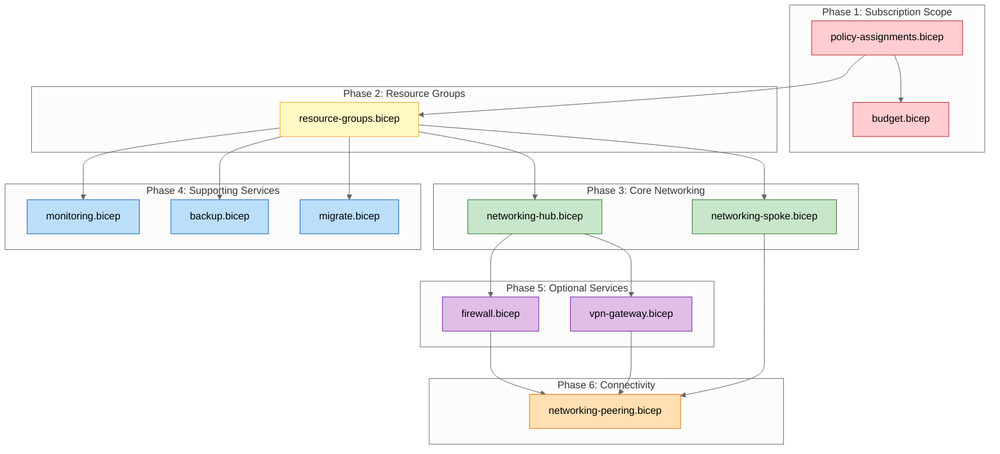

# Step 4: Implementation Plan - SMB Landing Zone

> Generated by bicep-plan agent | 2026-01-27 | Artifact v0.1

## Overview

This implementation plan defines the Bicep Infrastructure as Code for a cost-optimized,
repeatable Azure landing zone designed for on-premises workload migrations targeting SMB customers.

### Governance Alignment

This plan complies with governance constraints defined in `01-requirements.md` (greenfield project).

**Key constraints applied:**

- 21 Azure Policies deployed at subscription scope (Deny/Audit/DeployIfNotExists effects)
- Mandatory tags: Environment, Owner (Policy-enforced)
- Backup tag: `Backup: true` (Recommended for VMs - triggers auto-enrollment)
- Allowed regions: swedencentral, germanywestcentral, global
- Allowed VM SKUs: B-series, D/E v5/v6 series only

**Policy cleanup script:** `scripts/Remove-SmbLandingZonePolicies.ps1`

### Architecture Summary

| Aspect               | Decision                                            |
| -------------------- | --------------------------------------------------- |
| **Topology**         | Hub-spoke network with reserved subnets             |
| **Region**           | swedencentral (primary)                             |
| **Cost Target**      | ~$48/month baseline, ~$363/month maximum            |
| **WAF Optimization** | Cost (9/10), accepting Reliability (4/10) trade-off |

---

## Resource Inventory

| #   | Resource                      | Type                                                     | SKU       | Resource Group   | Dependencies              |
| --- | ----------------------------- | -------------------------------------------------------- | --------- | ---------------- | ------------------------- |
| 1   | Policy Assignments (20)       | Microsoft.Authorization/policyAssignments                | N/A       | Subscription     | None                      |
| 2   | Hub Resource Group            | Microsoft.Resources/resourceGroups                       | N/A       | N/A              | Policy Assignments        |
| 3   | Spoke Resource Group          | Microsoft.Resources/resourceGroups                       | N/A       | N/A              | Policy Assignments        |
| 4   | Monitor Resource Group        | Microsoft.Resources/resourceGroups                       | N/A       | N/A              | Policy Assignments        |
| 5   | Backup Resource Group         | Microsoft.Resources/resourceGroups                       | N/A       | N/A              | Policy Assignments        |
| 6   | Migrate Resource Group        | Microsoft.Resources/resourceGroups                       | N/A       | N/A              | Policy Assignments        |
| 7   | Hub VNet                      | Microsoft.Network/virtualNetworks                        | N/A       | rg-hub           | Resource Group            |
| 8   | Spoke VNet                    | Microsoft.Network/virtualNetworks                        | N/A       | rg-spoke         | Resource Group            |
| 9   | Hub NSG                       | Microsoft.Network/networkSecurityGroups                  | N/A       | rg-hub           | Resource Group            |
| 10  | Spoke NSG                     | Microsoft.Network/networkSecurityGroups                  | N/A       | rg-spoke         | Resource Group            |
| 11  | Azure Bastion                 | Microsoft.Network/bastionHosts                           | Developer | rg-hub           | Hub VNet, Bastion Subnet  |
| 12  | NAT Gateway                   | Microsoft.Network/natGateways                            | Standard  | rg-spoke         | Spoke VNet                |
| 13  | NAT Gateway Public IP         | Microsoft.Network/publicIPAddresses                      | Standard  | rg-spoke         | Resource Group            |
| 14  | Private DNS Zone              | Microsoft.Network/privateDnsZones                        | N/A       | rg-hub           | Hub VNet                  |
| 15  | Log Analytics Workspace       | Microsoft.OperationalInsights/workspaces                 | PerGB2018 | rg-monitor       | Resource Group            |
| 16  | Recovery Services Vault       | Microsoft.RecoveryServices/vaults                        | Standard  | rg-backup        | Resource Group            |
| 17  | DefaultVMPolicy               | Microsoft.RecoveryServices/vaults/backupPolicies         | N/A       | rg-backup        | Recovery Services Vault   |
| 18  | Auto-Backup Policy Assignment | Microsoft.Authorization/policyAssignments                | N/A       | Subscription     | DefaultVMPolicy           |
| 19  | Azure Migrate Project         | Microsoft.Migrate/migrateProjects                        | N/A       | rg-migrate       | Resource Group            |
| 20  | Cost Management Budget        | Microsoft.Consumption/budgets                            | N/A       | Subscription     | None                      |
| 21  | Route Table (conditional)     | Microsoft.Network/routeTables                            | N/A       | rg-hub           | Firewall deployed         |
| 22  | Azure Firewall (optional)     | Microsoft.Network/azureFirewalls                         | Basic     | rg-hub           | Hub VNet, Firewall Subnet |
| 23  | VPN Gateway (optional)        | Microsoft.Network/virtualNetworkGateways                 | VpnGw1AZ  | rg-hub           | Hub VNet, Gateway Subnet  |
| 24  | VNet Peering (conditional)    | Microsoft.Network/virtualNetworks/virtualNetworkPeerings | N/A       | rg-hub, rg-spoke | Firewall or VPN deployed  |

---

## Module Structure

```
infra/bicep/smb-landing-zone/
├── main.bicep                      # Orchestration entry point
├── main.bicepparam                 # Parameter file with defaults
├── modules/
│   ├── policy-assignments.bicep   # 20 Azure Policy assignments (subscription scope)
│   ├── policy-backup-auto.bicep   # Auto-backup policy (smb-lz-backup-02, DeployIfNotExists)
│   ├── resource-groups.bicep      # 5 resource groups
│   ├── networking-hub.bicep       # Hub VNet, NSG, Bastion, DNS
│   ├── networking-spoke.bicep     # Spoke VNet, NSG, NAT Gateway
│   ├── networking-peering.bicep   # VNet peering (hub→spoke, conditional)
│   ├── networking-peering-spoke.bicep # VNet peering (spoke→hub, conditional)
│   ├── route-tables.bicep         # UDR for firewall routing (conditional)
│   ├── monitoring.bicep           # Log Analytics Workspace
│   ├── backup.bicep               # Recovery Services Vault + DefaultVMPolicy
│   ├── migrate.bicep              # Azure Migrate Project
│   ├── budget.bicep               # Cost Management Budget
│   ├── firewall.bicep             # Azure Firewall Basic (AVM module, optional)
│   └── vpn-gateway.bicep          # VPN Gateway (optional)
├── scripts/
│   └── Remove-SmbLandingZonePolicies.ps1
└── deploy.ps1                      # Deployment orchestration script
```

---

## Implementation Tasks

### Task 0: modules/policy-assignments.bicep

**Purpose**: Deploy 20 Azure Policy assignments at subscription scope

> **Note**: Policy #21 (smb-lz-backup-02) is deployed via `policy-backup-auto.bicep` after
> the Recovery Services Vault is created, as it requires the vault ID as a parameter.

**Scope**: `targetScope = 'subscription'`

**Policy Assignments**:

| #   | Policy                   | Built-in ID                          | Effect            | Assignment Name      |
| --- | ------------------------ | ------------------------------------ | ----------------- | -------------------- |
| 1   | Allowed VM SKUs          | cccc23c7-8427-4f53-ad12-b6a63eb452b3 | Deny              | smb-lz-compute-01    |
| 2   | No public IPs on NICs    | 83a86a26-fd1f-447c-b59d-e51f44264114 | Deny              | smb-lz-compute-02    |
| 3   | Audit managed disks      | 06a78e20-9358-41c9-923c-fb736d382a4d | Audit             | smb-lz-compute-03    |
| 4   | Audit ARM VMs            | 1d84d5fb-01f6-4d12-ba4f-4a26081d403d | Audit             | smb-lz-compute-04    |
| 5   | NSG on subnets           | e71308d3-144b-4262-b144-efdc3cc90517 | AuditIfNotExists  | smb-lz-network-01    |
| 6   | Close management ports   | 22730e10-96f6-4aac-ad84-9383d35b5917 | AuditIfNotExists  | smb-lz-network-02    |
| 7   | Restrict NSG ports       | 9daedab3-fb2d-461e-b861-71790eead4f6 | AuditIfNotExists  | smb-lz-network-03    |
| 8   | Disable IP forwarding    | 88c0b9da-ce96-4b03-9635-f29a937e2900 | Deny              | smb-lz-network-04    |
| 9   | Storage HTTPS only       | 404c3081-a854-4457-ae30-26a93ef643f9 | Deny              | smb-lz-storage-01    |
| 10  | No public blob access    | 4fa4b6c0-31ca-4c0d-b10d-24b96f62a751 | Deny              | smb-lz-storage-02    |
| 11  | Storage TLS 1.2          | fe83a0eb-a853-422d-aac2-1bffd182c5d0 | Deny              | smb-lz-storage-03    |
| 12  | Restrict storage network | 34c877ad-507e-4c82-993e-3452a6e0ad3c | Audit             | smb-lz-storage-04    |
| 13  | Storage ARM migration    | 37e0d2fe-28a5-43d6-a273-67d37d1f5606 | Audit             | smb-lz-storage-05    |
| 14  | SQL Azure AD-only        | abda6d70-9778-44e7-84a8-06f9e9f5b64b | Audit             | smb-lz-identity-01   |
| 15  | SQL no public access     | 1b8ca024-1d5c-4dec-8995-b1a932b41780 | Audit             | smb-lz-identity-02   |
| 16  | Require Environment tag  | 871b6d14-10aa-478d-b590-94f262ecfa99 | Deny              | smb-lz-tagging-01    |
| 17  | Require Owner tag        | 871b6d14-10aa-478d-b590-94f262ecfa99 | Deny              | smb-lz-tagging-02    |
| 18  | Allowed locations        | e56962a6-4747-49cd-b67b-bf8b01975c4c | Deny              | smb-lz-governance-01 |
| 19  | VM backup required       | 013e242c-8828-4970-87b3-ab247555486d | AuditIfNotExists  | smb-lz-backup-01     |
| 20  | Diagnostic settings      | 7f89b1eb-583c-429a-8828-af049802c1d9 | AuditIfNotExists  | smb-lz-monitoring-01 |
| 21  | Auto-backup VMs (tag)    | 345fa903-145c-4fe1-8bcd-93ec2adccde8 | DeployIfNotExists | smb-lz-backup-02     |

> **Note**: Policy #21 (smb-lz-backup-02) automatically configures backup for VMs tagged with `Backup: true`
> to the central Recovery Services Vault using DefaultVMPolicy (30d daily, 12w weekly, 12m monthly retention).

**Parameters**:

```bicep
param allowedLocations array = ['swedencentral', 'germanywestcentral', 'global']
param allowedVmSkus array = [
  'Standard_B*'
  'Standard_D*v5'
  'Standard_D*s_v5'
  'Standard_D*v6'
  'Standard_D*s_v6'
  'Standard_E*v5'
  'Standard_E*s_v5'
  'Standard_E*v6'
  'Standard_E*s_v6'
]
param requiredTags array = ['Environment', 'Owner']
```

**Cleanup Script**: `scripts/Remove-SmbLandingZonePolicies.ps1`

---

### Task 1: main.bicep (Orchestration)

**Purpose**: Main entry point that orchestrates all module deployments

**Scope**: `targetScope = 'subscription'`

**Parameters**:

| Parameter             | Type   | Default       | Description                                     |
| --------------------- | ------ | ------------- | ----------------------------------------------- |
| location              | string | swedencentral | Primary deployment region                       |
| environment           | string | prod          | Environment tag value                           |
| owner                 | string | (required)    | Owner tag value                                 |
| hubVnetAddressSpace   | string | 10.0.0.0/16   | Hub VNet CIDR                                   |
| spokeVnetAddressSpace | string | 10.1.0.0/16   | Spoke VNet CIDR                                 |
| scenario              | string | baseline      | Deployment scenario: baseline/firewall/vpn/full |
| logAnalyticsDailyCap  | int    | 500           | Log Analytics daily cap in MB                   |
| budgetAmount          | int    | 500           | Monthly budget in USD                           |

**Scenarios**:

| Scenario   | Firewall | VPN | NAT GW | Peering | UDR | Monthly Cost |
| ---------- | :------: | :-: | :----: | :-----: | :-: | -----------: |
| `baseline` |    ❌    | ❌  |   ✅   |   ❌    | ❌  |         ~$48 |
| `firewall` |    ✅    | ❌  |   ❌   |   ✅    | ✅  |        ~$336 |
| `vpn`      |    ❌    | ✅  |   ❌   |   ✅    | ❌  |        ~$187 |
| `full`     |    ✅    | ✅  |   ❌   |   ✅    | ✅  |        ~$476 |

**Variables**:

```bicep
var uniqueSuffix = uniqueString(subscription().subscriptionId)
var regionShort = location == 'swedencentral' ? 'swc' : 'gwc'
var projectName = 'smb-lz'
var deployFirewall = scenario == 'firewall' || scenario == 'full'
var deployVpnGateway = scenario == 'vpn' || scenario == 'full'
var deployPeering = deployFirewall || deployVpnGateway
```

**Modules Called** (in order):

1. policy-assignments.bicep (20 base policies)
2. budget.bicep
3. resource-groups.bicep
4. networking-hub.bicep
5. networking-spoke.bicep
6. monitoring.bicep
7. backup.bicep (includes DefaultVMPolicy)
8. policy-backup-auto.bicep (smb-lz-backup-02, depends on backup.bicep outputs)
9. migrate.bicep
10. firewall.bicep (conditional: firewall/full scenarios)
11. route-tables.bicep (conditional: firewall/full scenarios)
12. vpn-gateway.bicep (conditional: vpn/full scenarios)
13. networking-peering.bicep (conditional: hub→spoke, when firewall or vpn deployed)
14. networking-peering-spoke.bicep (conditional: spoke→hub, when firewall or vpn deployed)

---

### Task 2: modules/resource-groups.bicep

**Purpose**: Create 5 resource groups with mandatory tags

**Scope**: `targetScope = 'subscription'`

**Resources**:

| Resource Group | Name Pattern              | Purpose                          |
| -------------- | ------------------------- | -------------------------------- |
| Hub            | rg-hub-{env}-{region}     | Hub VNet, Bastion, Firewall, VPN |
| Spoke          | rg-spoke-{env}-{region}   | Spoke VNet, NAT Gateway          |
| Monitor        | rg-monitor-{env}-{region} | Log Analytics                    |
| Backup         | rg-backup-{env}-{region}  | Recovery Services Vault          |
| Migrate        | rg-migrate-{env}-{region} | Azure Migrate Project            |

**Key Configuration**:

```bicep
resource rgHub 'Microsoft.Resources/resourceGroups@2024-03-01' = {
  name: 'rg-hub-${environment}-${regionShort}'
  location: location
  tags: {
    Environment: environment
    Owner: owner
    Project: 'smb-landing-zone'
    ManagedBy: 'Bicep'
  }
}
```

**Outputs**: Resource group names and IDs

---

### Task 3: modules/networking-hub.bicep

**Purpose**: Deploy hub VNet with Bastion, NSG, and Private DNS Zone

**Resources**:

| Resource            | Name Pattern            | Configuration                |
| ------------------- | ----------------------- | ---------------------------- |
| Hub VNet            | vnet-hub-{env}-{region} | Address space from parameter |
| AzureBastionSubnet  | /26                     | 10.0.0.0/26                  |
| AzureFirewallSubnet | /26                     | 10.0.0.64/26 (reserved)      |
| GatewaySubnet       | /27                     | 10.0.0.128/27 (reserved)     |
| Hub NSG             | nsg-hub-{env}-{region}  | Default deny inbound         |
| Azure Bastion       | bas-hub-{env}-{region}  | Developer SKU                |
| Private DNS Zone    | privatelink.azure.com   | Auto-registration enabled    |

**Key Configuration**:

```bicep
resource bastion 'Microsoft.Network/bastionHosts@2024-01-01' = {
  name: 'bas-hub-${environment}-${regionShort}'
  location: location
  sku: {
    name: 'Developer'
  }
  properties: {
    virtualNetwork: {
      id: hubVnet.id
    }
  }
  tags: tags
}
```

**Outputs**: VNet ID, Subnet IDs, Bastion ID, DNS Zone ID

---

### Task 4: modules/networking-spoke.bicep

**Purpose**: Deploy spoke VNet with NAT Gateway and NSG

**Resources**:

| Resource              | Name Pattern              | Configuration                |
| --------------------- | ------------------------- | ---------------------------- |
| Spoke VNet            | vnet-spoke-{env}-{region} | Address space from parameter |
| WorkloadSubnet        | /24                       | 10.1.0.0/24                  |
| Spoke NSG             | nsg-spoke-{env}-{region}  | Default deny inbound         |
| NAT Gateway Public IP | pip-nat-{env}-{region}    | Standard, Static             |
| NAT Gateway           | nat-spoke-{env}-{region}  | Standard SKU                 |

**Key Configuration**:

```bicep
resource natGateway 'Microsoft.Network/natGateways@2024-01-01' = {
  name: 'nat-spoke-${environment}-${regionShort}'
  location: location
  sku: {
    name: 'Standard'
  }
  properties: {
    publicIpAddresses: [
      { id: natPublicIp.id }
    ]
    idleTimeoutInMinutes: 4
  }
  tags: tags
}
```

**Outputs**: VNet ID, Subnet IDs, NAT Gateway ID

---

### Task 5: modules/monitoring.bicep

**Purpose**: Deploy Log Analytics Workspace with daily cap

**Resources**:

| Resource      | Name Pattern                 | Configuration                              |
| ------------- | ---------------------------- | ------------------------------------------ |
| Log Analytics | log-{project}-{env}-{region} | PerGB2018, 500MB/day cap, 30-day retention |

**Key Configuration**:

```bicep
resource logAnalytics 'Microsoft.OperationalInsights/workspaces@2023-09-01' = {
  name: 'log-smblz-${environment}-${regionShort}'
  location: location
  properties: {
    sku: {
      name: 'PerGB2018'
    }
    retentionInDays: 30
    workspaceCapping: {
      dailyQuotaGb: dailyCapMb / 1024
    }
  }
  tags: tags
}
```

**Outputs**: Workspace ID, Workspace Key

---

### Task 6: modules/backup.bicep

**Purpose**: Deploy Recovery Services Vault for VM backup

**Resources**:

| Resource                | Name Pattern                 | Configuration |
| ----------------------- | ---------------------------- | ------------- |
| Recovery Services Vault | rsv-{project}-{env}-{region} | Standard, LRS |

**Key Configuration**:

```bicep
resource vault 'Microsoft.RecoveryServices/vaults@2024-04-01' = {
  name: 'rsv-smblz-${environment}-${regionShort}'
  location: location
  sku: {
    name: 'RS0'
    tier: 'Standard'
  }
  properties: {
    publicNetworkAccess: 'Enabled'
  }
  tags: tags
}
```

**Outputs**: Vault ID, Vault Name

---

### Task 7: modules/migrate.bicep

**Purpose**: Deploy Azure Migrate Project for server assessment

**Resources**:

| Resource              | Name Pattern                     | Configuration     |
| --------------------- | -------------------------------- | ----------------- |
| Azure Migrate Project | migrate-{project}-{env}-{region} | Server assessment |

**Outputs**: Project ID

---

### Task 8: modules/budget.bicep

**Purpose**: Deploy Cost Management Budget with alerts

**Scope**: `targetScope = 'subscription'`

**Resources**:

| Resource | Name Pattern          | Configuration                  |
| -------- | --------------------- | ------------------------------ |
| Budget   | budget-smb-lz-monthly | $500/month, 80% forecast alert |

**Key Configuration**:

```bicep
resource budget 'Microsoft.Consumption/budgets@2023-11-01' = {
  name: 'budget-smb-lz-monthly'
  properties: {
    category: 'Cost'
    amount: budgetAmount
    timeGrain: 'Monthly'
    timePeriod: {
      startDate: startDate
    }
    notifications: {
      forecastAlert: {
        enabled: true
        operator: 'GreaterThan'
        threshold: 80
        contactEmails: [ownerEmail]
        thresholdType: 'Forecasted'
      }
    }
  }
}
```

**Outputs**: Budget ID

---

### Task 9: modules/firewall.bicep (Optional)

**Purpose**: Deploy Azure Firewall Basic (for `firewall` and `full` scenarios)

**Condition**: `scenario == 'firewall' || scenario == 'full'`

**Resources**:

| Resource           | Name Pattern          | Configuration    |
| ------------------ | --------------------- | ---------------- |
| Firewall Public IP | pip-fw-{env}-{region} | Standard, Static |
| Azure Firewall     | fw-hub-{env}-{region} | Basic SKU        |

**Outputs**: Firewall ID, Firewall Private IP

---

### Task 10: modules/vpn-gateway.bicep (Optional)

**Purpose**: Deploy VPN Gateway (for `vpn` and `full` scenarios)

**Condition**: `scenario == 'vpn' || scenario == 'full'`

**Resources**:

| Resource          | Name Pattern            | Configuration              |
| ----------------- | ----------------------- | -------------------------- |
| Gateway Public IP | pip-vpn-{env}-{region}  | Standard, Static, Zone 1-3 |
| VPN Gateway       | vpng-hub-{env}-{region} | VpnGw1AZ (zone-redundant)  |

**Key Configuration**:

```bicep
resource vpnGateway 'Microsoft.Network/virtualNetworkGateways@2024-01-01' = {
  name: 'vpng-hub-${environment}-${regionShort}'
  location: location
  properties: {
    gatewayType: 'Vpn'
    vpnType: 'RouteBased'
    vpnGatewayGeneration: 'Generation1'
    sku: {
      name: 'VpnGw1AZ'
      tier: 'VpnGw1AZ'
    }
    ipConfigurations: [...]
  }
  tags: tags
}
```

**Outputs**: Gateway ID, Gateway Public IP

---

### Task 11: modules/networking-peering.bicep (Conditional)

**Purpose**: Configure VNet peering between hub and spoke

**Condition**: `deployFirewall == true || deployVpnGateway == true`

**Resources**:

| Resource             | Name Pattern      | Configuration           |
| -------------------- | ----------------- | ----------------------- |
| Hub-to-Spoke Peering | peer-hub-to-spoke | Allow forwarded traffic |
| Spoke-to-Hub Peering | peer-spoke-to-hub | Use remote gateway      |

**Outputs**: Peering IDs

---

### Task 12: deploy.ps1 (Deployment Script)

**Purpose**: PowerShell script for deployment orchestration

**Features**:

- Parameter validation
- Azure CLI authentication check
- Bicep lint and build verification
- What-If preview with user confirmation
- Deployment execution (subscription scope)
- Output display and logging

**Usage**:

```powershell
.\deploy.ps1 -Scenario baseline -Owner "partner-ops@contoso.com" -WhatIf
.\deploy.ps1 -Scenario full -Owner "partner-ops@contoso.com"
```

---

## Dependency Graph



**Deployment Order**:

1. **Phase 1** (Subscription): Policy assignments, Budget
2. **Phase 2** (Foundation): 5 Resource Groups
3. **Phase 3** (Networking): Hub VNet, Spoke VNet (parallel)
4. **Phase 4** (Services): Log Analytics, Recovery Vault, Azure Migrate (parallel)
5. **Phase 5** (Optional): Azure Firewall, VPN Gateway (if enabled)
6. **Phase 6** (Connectivity): VNet Peering (if Firewall or VPN deployed)

---

## Naming Conventions

| Resource Type    | Pattern                        | Example               | Notes                            |
| ---------------- | ------------------------------ | --------------------- | -------------------------------- |
| Resource Group   | rg-{workload}-{env}-{region}   | rg-hub-slz-swc        | Shared services use `slz` as env |
| Virtual Network  | vnet-{workload}-{env}-{region} | vnet-hub-slz-swc      | Hub uses `slz`, spoke uses env   |
| Subnet           | snet-{purpose}                 | snet-workload         |                                  |
| NSG              | nsg-{workload}-{env}-{region}  | nsg-hub-slz-swc       | Shared services use `slz`        |
| NAT Gateway      | nat-{workload}-{env}-{region}  | nat-spoke-prod-swc    | Spoke uses environment parameter |
| Public IP        | pip-{purpose}-{env}-{region}   | pip-nat-prod-swc      |                                  |
| Azure Bastion    | bas-{workload}-{env}-{region}  | bas-hub-slz-swc       | Shared services use `slz`        |
| Azure Firewall   | fw-{workload}-{env}-{region}   | fw-hub-slz-swc        | Shared services use `slz`        |
| VPN Gateway      | vpng-{workload}-{env}-{region} | vpng-hub-slz-swc      | Shared services use `slz`        |
| Log Analytics    | log-{project}-{env}-{region}   | log-smblz-slz-swc     | Shared services use `slz`        |
| Recovery Vault   | rsv-{project}-{env}-{region}   | rsv-smblz-slz-swc     | Shared services use `slz`        |
| Private DNS Zone | {service}.azure.com            | privatelink.azure.com |                                  |
| Budget           | budget-{project}-monthly       | budget-smb-lz-monthly |                                  |

**Region Abbreviations**:

- swedencentral: `swc`
- germanywestcentral: `gwc`

---

## Security Configuration

| Resource         | Security Setting | Value                    | Policy Enforced      |
| ---------------- | ---------------- | ------------------------ | -------------------- |
| Hub NSG          | Default Inbound  | Deny All                 | ✅ smb-lz-network-01 |
| Spoke NSG        | Default Inbound  | Deny All                 | ✅ smb-lz-network-01 |
| Azure Bastion    | SKU              | Developer (no public IP) | N/A                  |
| NAT Gateway      | Outbound SNAT    | Enabled                  | N/A                  |
| Log Analytics    | Retention        | 30 days                  | N/A                  |
| VMs (future)     | Public IPs       | Denied                   | ✅ smb-lz-compute-02 |
| VMs (future)     | Allowed SKUs     | B/D/E v5/v6              | ✅ smb-lz-compute-01 |
| Storage (future) | HTTPS Only       | Required                 | ✅ smb-lz-storage-01 |
| Storage (future) | TLS Version      | 1.2+                     | ✅ smb-lz-storage-03 |
| Storage (future) | Public Access    | Denied                   | ✅ smb-lz-storage-02 |

---

## Estimated Implementation Time

| Task                      | Estimated Duration | Notes                       |
| ------------------------- | ------------------ | --------------------------- |
| Policy Assignments        | 5 minutes          | 20 policy assignments       |
| Resource Groups           | 2 minutes          | 5 resource groups           |
| Hub Networking            | 10 minutes         | VNet, subnets, Bastion, DNS |
| Spoke Networking          | 5 minutes          | VNet, subnets, NAT Gateway  |
| Monitoring                | 3 minutes          | Log Analytics               |
| Backup                    | 3 minutes          | Recovery Services Vault     |
| Migration                 | 2 minutes          | Azure Migrate Project       |
| Budget                    | 1 minute           | Cost Management Budget      |
| Azure Firewall (optional) | 15 minutes         | Firewall deployment is slow |
| VPN Gateway (optional)    | 30 minutes         | Gateway deployment is slow  |
| VNet Peering              | 2 minutes          | If Firewall or VPN enabled  |
| **Baseline Total**        | **~31 minutes**    | Without optional services   |
| **Maximum Total**         | **~78 minutes**    | With Firewall + VPN Gateway |

---

## Approval Gate

> **📋 Implementation Plan Ready**
>
> - **21 Azure resources** planned (baseline) + 2 optional
> - **12 Bicep modules** to create
> - **20 Azure Policies** to deploy
> - **$48-$363/month** estimated cost range
> - Governance constraints addressed (greenfield)
> - CAF naming conventions applied
> - ADR-0001 architecture decision documented
>
> **Do you approve this implementation plan?**
>
> - Reply **"approve"** to proceed to bicep-code
> - Reply with **feedback** to refine the plan
> - Reply **"no"** to return to architecture review

---

_Plan generated by bicep-plan agent following Azure Well-Architected Framework guidelines._
_Architecture decision documented in ADR-0001._
