```mermaid
%%{init: {'theme':'neutral'}}%%
graph TB
    subgraph Internet
        WEB[("☁️ Internet")]
    end

    subgraph HUB["Hub VNet (10.0.0.0/16)"]
        FW["🔥 Azure Firewall Basic<br/>10.0.2.0/26"]
        FWMGMT["Firewall Mgmt<br/>10.0.2.64/26"]
        BAS["🏰 Bastion Developer<br/>10.0.1.0/26"]
        DNS["🔒 Private DNS Zone"]
    end

    subgraph SPOKE["Spoke VNet (10.1.0.0/16)"]
        WORKLOAD["💼 Workload Subnet<br/>10.1.1.0/24"]
        DATA["💾 Data Subnet<br/>10.1.2.0/24"]
    end

    WEB <-->|"PIP"| FW
    FW <-->|"Peering"| WORKLOAD
    FW <-->|"Peering"| DATA
    BAS -->|"RDP/SSH"| WORKLOAD
    WORKLOAD -.->|"UDR: 0.0.0.0/0"| FW
    DNS -.-> SPOKE
```

```mermaid
%%{init: {'theme':'neutral'}}%%
graph TB
    subgraph OnPrem["On-Premises (192.168.0.0/16)"]
        ONPREM_GW["🏢 VPN Device"]
    end

    subgraph Internet
        WEB[("☁️ Internet")]
    end

    subgraph HUB["Hub VNet (10.0.0.0/16)"]
        VPN["🔐 VPN Gateway VpnGw1AZ<br/>10.0.0.128/27"]
        BAS["🏰 Bastion Developer<br/>10.0.1.0/26"]
        DNS["🔒 Private DNS Zone"]
    end

    subgraph SPOKE["Spoke VNet (10.1.0.0/16)"]
        WORKLOAD["💼 Workload Subnet<br/>10.1.1.0/24"]
        DATA["💾 Data Subnet<br/>10.1.2.0/24"]
    end

    ONPREM_GW <-->|"S2S VPN"| VPN
    VPN <-->|"Peering<br/>+Gateway Transit"| SPOKE
    BAS -->|"RDP/SSH"| WORKLOAD
    WEB <-->|"Direct"| SPOKE
    DNS -.-> SPOKE
```

```mermaid
%%{init: {'theme':'neutral'}}%%
graph LR
    P[Policy] --> B[Budget]
    P --> RG[Resource Groups]
    RG --> HUB[Hub VNet]
    RG --> MON[Monitoring]
    RG --> BAK[Backup]
    RG --> MIG[Migrate]
    HUB --> SPOKE[Spoke VNet]
    HUB --> VPN["🔐 VPN Gateway<br/>(~25 min)"]
    VPN --> PEER[VNet Peering<br/>+Gateway Transit]

    style VPN fill:#4ecdc4,color:#fff
    style PEER fill:#4ecdc4,color:#fff
```

```mermaid
%%{init: {'theme':'neutral'}}%%
graph TB
    subgraph OnPrem["On-Premises (192.168.0.0/16)"]
        ONPREM_GW["🏢 VPN Device"]
    end

    subgraph Internet
        WEB[("☁️ Internet")]
    end

    subgraph HUB["Hub VNet (10.0.0.0/16)"]
        VPN["🔐 VPN Gateway VpnGw1AZ<br/>10.0.0.128/27"]
        FW["🔥 Azure Firewall Basic<br/>10.0.2.0/26"]
        FWMGMT["Firewall Mgmt<br/>10.0.2.64/26"]
        BAS["🏰 Bastion Developer<br/>10.0.1.0/26"]
        DNS["🔒 Private DNS Zone"]
    end

    subgraph SPOKE["Spoke VNet (10.1.0.0/16)"]
        WORKLOAD["💼 Workload Subnet<br/>10.1.1.0/24"]
        DATA["💾 Data Subnet<br/>10.1.2.0/24"]
    end

    ONPREM_GW <-->|"S2S VPN"| VPN
    WEB <-->|"PIP"| FW
    VPN <-->|"UDR"| FW
    FW <-->|"Peering"| SPOKE
    BAS -->|"RDP/SSH"| WORKLOAD
    WORKLOAD -.->|"UDR: 0.0.0.0/0"| FW
    WORKLOAD -.->|"UDR: 192.168.0.0/16"| FW
    DNS -.-> SPOKE
```

```mermaid
%%{init: {'theme':'neutral'}}%%
graph LR
    P[Policy] --> B[Budget]
    P --> RG[Resource Groups]
    RG --> HUB[Hub VNet]
    RG --> MON[Monitoring]
    RG --> BAK[Backup]
    RG --> MIG[Migrate]
    HUB --> FW["🔥 Firewall"]
    HUB --> VPN["🔐 VPN Gateway<br/>(~25 min)"]
    FW --> RT[Route Tables]
    RT --> SPOKE[Spoke VNet<br/>+UDR]
    VPN --> PEER[VNet Peering<br/>+Gateway Transit]

    style FW fill:#ff6b6b,color:#fff
    style VPN fill:#4ecdc4,color:#fff
    style RT fill:#ff6b6b,color:#fff
    style PEER fill:#9b59b6,color:#fff
```

# Scenario Implementation Plans - SMB Ready Foundation

> Generated by bicep-plan agent | 2026-01-29 | Artifact v0.1

## Overview

This document defines implementation plans for the 4 supported deployment scenarios of the SMB
SMB Ready Foundation. Each scenario is a valid production configuration with different cost/capability
trade-offs.

### Scenario Matrix

| #   | Scenario                    | Firewall | VPN | NAT GW | Peering | UDR | Monthly Cost |
| --- | --------------------------- | :------: | :-: | :----: | :-----: | :-: | ------------ |
| 1   | Firewall Only               |    ✅    | ❌  |   ❌   |   ✅    | ✅  | ~$336        |
| 2   | VPN Only                    |    ❌    | ✅  |   ❌   |   ✅    | ❌  | ~$187        |
| 3   | Firewall + VPN              |    ✅    | ✅  |   ❌   |   ✅    | ✅  | ~$476        |
| 4   | NAT Gateway Only (Baseline) |    ❌    | ❌  |   ✅   |   ❌    | ❌  | ~$48         |

### Deployment Command Reference

```powershell
# Scenario 1: Firewall only (~$336/mo)
./deploy.ps1 -Scenario firewall

# Scenario 2: VPN only (~$187/mo)
./deploy.ps1 -Scenario vpn

# Scenario 3: Firewall + VPN (~$476/mo)
./deploy.ps1 -Scenario full

# Scenario 4: Baseline (NAT Gateway only, ~$48/mo)
./deploy.ps1 -Scenario baseline
```

---

## Scenario 1: Hub-Spoke with Firewall Only

### Use Case

Enterprise-grade network security with centralized traffic inspection. Ideal for:

- Organizations requiring outbound traffic filtering
- Compliance requirements mandating egress control
- Environments where VPN connectivity is not needed (cloud-only or ExpressRoute)

### Architecture Diagram



### Resource Inventory

| #   | Resource                | Type                   | SKU       | Resource Group     |
| --- | ----------------------- | ---------------------- | --------- | ------------------ |
| 1   | Policy Assignments (20) | policyAssignments      | N/A       | Subscription       |
| 2   | Budget                  | budgets                | N/A       | Subscription       |
| 3   | Resource Groups (5)     | resourceGroups         | N/A       | N/A                |
| 4   | Hub VNet                | virtualNetworks        | N/A       | rg-hub-smb-swc     |
| 5   | Spoke VNet              | virtualNetworks        | N/A       | rg-spoke-prod-swc  |
| 6   | Azure Bastion           | bastionHosts           | Developer | rg-hub-smb-swc     |
| 7   | Private DNS Zone        | privateDnsZones        | N/A       | rg-hub-smb-swc     |
| 8   | **Azure Firewall**      | azureFirewalls         | **Basic** | rg-hub-smb-swc     |
| 9   | Firewall Policy         | firewallPolicies       | Basic     | rg-hub-smb-swc     |
| 10  | Firewall Public IP      | publicIPAddresses      | Standard  | rg-hub-smb-swc     |
| 11  | Firewall Mgmt Public IP | publicIPAddresses      | Standard  | rg-hub-smb-swc     |
| 12  | **Route Tables (UDR)**  | routeTables            | N/A       | rg-hub-smb-swc     |
| 13  | **VNet Peering**        | virtualNetworkPeerings | N/A       | Both VNets         |
| 14  | Log Analytics           | workspaces             | PerGB2018 | rg-monitor-smb-swc |
| 15  | Recovery Vault          | vaults                 | Standard  | rg-backup-smb-swc  |
| 16  | Migrate Project         | migrateProjects        | N/A       | rg-migrate-smb-swc |

### Deployment Sequence


### Key Configuration

**Firewall Rules (Network Rule Collection Group):**

| Rule                   | Source      | Destination    | Ports | Protocol |
| ---------------------- | ----------- | -------------- | ----- | -------- |
| AllowDNS               | 10.1.0.0/16 | 168.63.129.16  | 53    | UDP/TCP  |
| AllowNTP               | 10.1.0.0/16 | \*             | 123   | UDP      |
| AllowICMP              | 10.1.0.0/16 | \*             | \*    | ICMP     |
| AllowHTTP              | 10.1.0.0/16 | \*             | 80    | TCP      |
| AllowHTTPS             | 10.1.0.0/16 | \*             | 443   | TCP      |
| AllowAzureServices     | 10.1.0.0/16 | AzureCloud     | \*    | Any      |
| AllowWindowsActivation | 10.1.0.0/16 | 23.102.135.246 | 1688  | TCP      |

**Route Table (UDR):**

| Route      | Address Prefix | Next Hop Type    | Next Hop IP |
| ---------- | -------------- | ---------------- | ----------- |
| ToInternet | 0.0.0.0/0      | VirtualAppliance | 10.0.2.4    |

**VNet Peering Settings:**

| Setting                   | Hub→Spoke | Spoke→Hub |
| ------------------------- | --------- | --------- |
| allowVirtualNetworkAccess | true      | true      |
| allowForwardedTraffic     | true      | true      |
| allowGatewayTransit       | false     | false     |
| useRemoteGateways         | false     | false     |

### Cost Breakdown

| Resource                | SKU       | Monthly Cost    |
| ----------------------- | --------- | --------------- |
| Azure Firewall Basic    | Basic     | $228.00         |
| Firewall Public IPs (2) | Standard  | $7.30           |
| Bastion Developer       | Developer | $0.26/hr (~$47) |
| Log Analytics           | PerGB2018 | ~$2.30/GB       |
| Recovery Vault          | Standard  | ~$10            |
| **Total**               |           | **~$336/month** |

### Validation Checklist

- [ ] Firewall deployed with Basic SKU
- [ ] Firewall Policy with network rules attached
- [ ] Route table associated with spoke subnets
- [ ] UDR routes traffic to firewall private IP (10.0.2.4)
- [ ] VNet peering established (no gateway transit)
- [ ] NAT Gateway NOT deployed
- [ ] Bastion can connect to spoke VMs

---

## Scenario 2: Hub-Spoke with VPN Gateway Only

### Use Case

Hybrid connectivity for on-premises integration without egress filtering. Ideal for:

- Organizations with existing on-premises datacenters
- Site-to-site VPN connectivity requirements
- Environments where firewall is managed separately (on-prem or third-party)

### Architecture Diagram



### Resource Inventory

| #   | Resource                | Type                   | SKU          | Resource Group     |
| --- | ----------------------- | ---------------------- | ------------ | ------------------ |
| 1   | Policy Assignments (20) | policyAssignments      | N/A          | Subscription       |
| 2   | Budget                  | budgets                | N/A          | Subscription       |
| 3   | Resource Groups (5)     | resourceGroups         | N/A          | N/A                |
| 4   | Hub VNet                | virtualNetworks        | N/A          | rg-hub-smb-swc     |
| 5   | Spoke VNet              | virtualNetworks        | N/A          | rg-spoke-prod-swc  |
| 6   | Azure Bastion           | bastionHosts           | Developer    | rg-hub-smb-swc     |
| 7   | Private DNS Zone        | privateDnsZones        | N/A          | rg-hub-smb-swc     |
| 8   | **VPN Gateway**         | virtualNetworkGateways | **VpnGw1AZ** | rg-hub-smb-swc     |
| 9   | VPN Gateway Public IP   | publicIPAddresses      | Standard     | rg-hub-smb-swc     |
| 10  | **VNet Peering**        | virtualNetworkPeerings | N/A          | Both VNets         |
| 11  | Log Analytics           | workspaces             | PerGB2018    | rg-monitor-smb-swc |
| 12  | Recovery Vault          | vaults                 | Standard     | rg-backup-smb-swc  |
| 13  | Migrate Project         | migrateProjects        | N/A          | rg-migrate-smb-swc |

### Deployment Sequence



### Key Configuration

**VPN Gateway Configuration:**

| Setting        | Value               |
| -------------- | ------------------- |
| SKU            | VpnGw1AZ            |
| Generation     | Generation1         |
| VPN Type       | RouteBased          |
| Active-Active  | false               |
| BGP Enabled    | false               |
| Zone Redundant | Yes (zones 1, 2, 3) |

**VNet Peering Settings (with Gateway Transit):**

| Setting                   | Hub→Spoke | Spoke→Hub |
| ------------------------- | --------- | --------- |
| allowVirtualNetworkAccess | true      | true      |
| allowForwardedTraffic     | true      | true      |
| **allowGatewayTransit**   | **true**  | false     |
| **useRemoteGateways**     | false     | **true**  |

**Route Propagation:**

- Spoke VNet automatically learns on-premises routes via VPN Gateway
- No manual UDR required for hybrid connectivity
- Gateway route propagation enabled on spoke subnets

### Cost Breakdown

| Resource              | SKU       | Monthly Cost    |
| --------------------- | --------- | --------------- |
| VPN Gateway           | VpnGw1AZ  | $139.72         |
| VPN Gateway Public IP | Standard  | $3.65           |
| Bastion Developer     | Developer | ~$47            |
| Log Analytics         | PerGB2018 | ~$2.30/GB       |
| Recovery Vault        | Standard  | ~$10            |
| **Total**             |           | **~$187/month** |

### Validation Checklist

- [ ] VPN Gateway deployed with VpnGw1AZ SKU
- [ ] VPN Gateway in zones 1, 2, 3 (zone-redundant)
- [ ] VNet peering with gateway transit enabled
- [ ] Spoke uses remote gateways from hub
- [ ] NAT Gateway NOT deployed
- [ ] Firewall NOT deployed
- [ ] Route tables NOT deployed
- [ ] Bastion can connect to spoke VMs

---

## Scenario 3: Hub-Spoke with Firewall + VPN Gateway

### Use Case

Full hybrid connectivity with centralized security. Ideal for:

- Organizations requiring both hybrid connectivity AND egress filtering
- Compliance requirements mandating traffic inspection for on-prem traffic
- Maximum security posture for regulated industries

### Architecture Diagram



### Resource Inventory

| #   | Resource                | Type                   | SKU          | Resource Group     |
| --- | ----------------------- | ---------------------- | ------------ | ------------------ |
| 1   | Policy Assignments (20) | policyAssignments      | N/A          | Subscription       |
| 2   | Budget                  | budgets                | N/A          | Subscription       |
| 3   | Resource Groups (5)     | resourceGroups         | N/A          | N/A                |
| 4   | Hub VNet                | virtualNetworks        | N/A          | rg-hub-smb-swc     |
| 5   | Spoke VNet              | virtualNetworks        | N/A          | rg-spoke-prod-swc  |
| 6   | Azure Bastion           | bastionHosts           | Developer    | rg-hub-smb-swc     |
| 7   | Private DNS Zone        | privateDnsZones        | N/A          | rg-hub-smb-swc     |
| 8   | **Azure Firewall**      | azureFirewalls         | **Basic**    | rg-hub-smb-swc     |
| 9   | Firewall Policy         | firewallPolicies       | Basic        | rg-hub-smb-swc     |
| 10  | Firewall Public IPs (2) | publicIPAddresses      | Standard     | rg-hub-smb-swc     |
| 11  | **VPN Gateway**         | virtualNetworkGateways | **VpnGw1AZ** | rg-hub-smb-swc     |
| 12  | VPN Gateway Public IP   | publicIPAddresses      | Standard     | rg-hub-smb-swc     |
| 13  | **Route Tables (2)**    | routeTables            | N/A          | rg-hub-smb-swc     |
| 14  | **VNet Peering**        | virtualNetworkPeerings | N/A          | Both VNets         |
| 15  | Log Analytics           | workspaces             | PerGB2018    | rg-monitor-smb-swc |
| 16  | Recovery Vault          | vaults                 | Standard     | rg-backup-smb-swc  |
| 17  | Migrate Project         | migrateProjects        | N/A          | rg-migrate-smb-swc |

### Deployment Sequence



### Key Configuration

**Firewall Rules (includes on-prem rules):**

| Rule                | Source         | Destination    | Ports | Protocol |
| ------------------- | -------------- | -------------- | ----- | -------- |
| AllowDNS            | 10.1.0.0/16    | 168.63.129.16  | 53    | UDP/TCP  |
| AllowNTP            | 10.1.0.0/16    | \*             | 123   | UDP      |
| AllowICMP           | 10.1.0.0/16    | \*             | \*    | ICMP     |
| AllowHTTP           | 10.1.0.0/16    | \*             | 80    | TCP      |
| AllowHTTPS          | 10.1.0.0/16    | \*             | 443   | TCP      |
| **AllowToOnPrem**   | 10.1.0.0/16    | 192.168.0.0/16 | \*    | Any      |
| **AllowFromOnPrem** | 192.168.0.0/16 | 10.1.0.0/16    | \*    | Any      |

**Route Tables:**

**Spoke UDR (rt-spoke-smb-swc):**

| Route      | Address Prefix | Next Hop Type    | Next Hop IP |
| ---------- | -------------- | ---------------- | ----------- |
| ToInternet | 0.0.0.0/0      | VirtualAppliance | 10.0.2.4    |
| ToOnPrem   | 192.168.0.0/16 | VirtualAppliance | 10.0.2.4    |

**Gateway UDR (rt-gateway-smb-swc):**

| Route   | Address Prefix | Next Hop Type    | Next Hop IP |
| ------- | -------------- | ---------------- | ----------- |
| ToSpoke | 10.1.0.0/16    | VirtualAppliance | 10.0.2.4    |

**VNet Peering Settings (with Gateway Transit):**

| Setting                   | Hub→Spoke | Spoke→Hub |
| ------------------------- | --------- | --------- |
| allowVirtualNetworkAccess | true      | true      |
| allowForwardedTraffic     | true      | true      |
| **allowGatewayTransit**   | **true**  | false     |
| **useRemoteGateways**     | false     | **true**  |

### Cost Breakdown

| Resource                | SKU       | Monthly Cost    |
| ----------------------- | --------- | --------------- |
| Azure Firewall Basic    | Basic     | $228.00         |
| Firewall Public IPs (2) | Standard  | $7.30           |
| VPN Gateway             | VpnGw1AZ  | $139.72         |
| VPN Gateway Public IP   | Standard  | $3.65           |
| Bastion Developer       | Developer | ~$47            |
| Log Analytics           | PerGB2018 | ~$2.30/GB       |
| Recovery Vault          | Standard  | ~$10            |
| **Total**               |           | **~$476/month** |

### Validation Checklist

- [ ] Firewall deployed with Basic SKU
- [ ] VPN Gateway deployed with VpnGw1AZ SKU
- [ ] Firewall rules include on-prem bi-directional rules
- [ ] Spoke UDR routes both internet AND on-prem via firewall
- [ ] Gateway UDR routes spoke traffic via firewall
- [ ] VNet peering with gateway transit enabled
- [ ] NAT Gateway NOT deployed
- [ ] Bastion can connect to spoke VMs

---

## Scenario 4: Hub-Spoke with NAT Gateway Only (Baseline)

### Use Case

Minimal cost baseline deployment for development or proof-of-concept. Ideal for:

- Development and testing environments
- Budget-constrained deployments
- Scenarios where firewall/VPN will be added later
- Cloud-native workloads without hybrid requirements

### Architecture Diagram


### Resource Inventory

| #   | Resource                | Type              | SKU       | Resource Group     |
| --- | ----------------------- | ----------------- | --------- | ------------------ |
| 1   | Policy Assignments (20) | policyAssignments | N/A       | Subscription       |
| 2   | Budget                  | budgets           | N/A       | Subscription       |
| 3   | Resource Groups (5)     | resourceGroups    | N/A       | N/A                |
| 4   | Hub VNet                | virtualNetworks   | N/A       | rg-hub-smb-swc     |
| 5   | Spoke VNet              | virtualNetworks   | N/A       | rg-spoke-prod-swc  |
| 6   | Azure Bastion           | bastionHosts      | Developer | rg-hub-smb-swc     |
| 7   | Private DNS Zone        | privateDnsZones   | N/A       | rg-hub-smb-swc     |
| 8   | **NAT Gateway**         | natGateways       | Standard  | rg-spoke-prod-swc  |
| 9   | NAT Gateway Public IP   | publicIPAddresses | Standard  | rg-spoke-prod-swc  |
| 10  | Log Analytics           | workspaces        | PerGB2018 | rg-monitor-smb-swc |
| 11  | Recovery Vault          | vaults            | Standard  | rg-backup-smb-swc  |
| 12  | Migrate Project         | migrateProjects   | N/A       | rg-migrate-smb-swc |

### Deployment Sequence


### Key Configuration

**NAT Gateway Configuration:**

| Setting      | Value           |
| ------------ | --------------- |
| SKU          | Standard        |
| Idle Timeout | 4 minutes       |
| Zones        | None (regional) |
| Public IPs   | 1               |

**Spoke Subnet Association:**

| Subnet                 | NAT Gateway        |
| ---------------------- | ------------------ |
| snet-workload-prod-swc | nat-spoke-prod-swc |
| snet-data-prod-swc     | nat-spoke-prod-swc |

**No VNet Peering Required:**

- Hub and Spoke VNets exist but are NOT peered
- Each VNet operates independently
- Bastion in hub cannot reach spoke (until peering added)

### Cost Breakdown

| Resource              | SKU       | Monthly Cost   |
| --------------------- | --------- | -------------- |
| NAT Gateway           | Standard  | $32.12         |
| NAT Gateway Public IP | Standard  | $3.65          |
| Bastion Developer     | Developer | ~$47           |
| Log Analytics         | PerGB2018 | ~$2.30/GB      |
| Recovery Vault        | Standard  | ~$10           |
| **Total**             |           | **~$48/month** |

### Validation Checklist

- [ ] NAT Gateway deployed in spoke VNet
- [ ] NAT Gateway associated with workload and data subnets
- [ ] VMs in spoke have outbound internet via NAT Gateway PIP
- [ ] Firewall NOT deployed
- [ ] VPN Gateway NOT deployed
- [ ] VNet peering NOT configured
- [ ] Route tables NOT deployed
- [ ] Hub Bastion cannot reach spoke (expected - no peering)

---

## Comparison Matrix

### Feature Comparison

| Feature                 | Scenario 1   | Scenario 2         | Scenario 3         | Scenario 4  |
| ----------------------- | ------------ | ------------------ | ------------------ | ----------- |
| **Egress Filtering**    | ✅ Firewall  | ❌ None            | ✅ Firewall        | ❌ None     |
| **Hybrid Connectivity** | ❌ None      | ✅ VPN             | ✅ VPN             | ❌ None     |
| **Traffic Inspection**  | ✅ All       | ❌ None            | ✅ All             | ❌ None     |
| **Outbound Internet**   | Firewall PIP | Direct             | Firewall PIP       | NAT Gateway |
| **VNet Peering**        | ✅ Yes       | ✅ Gateway Transit | ✅ Gateway Transit | ❌ No       |
| **UDR Required**        | ✅ Yes       | ❌ No              | ✅ Yes             | ❌ No       |
| **Deploy Time**         | ~10 min      | ~25 min            | ~25 min            | ~2 min      |

### Security Comparison

| Security Control        | Scenario 1 | Scenario 2 | Scenario 3 | Scenario 4 |
| ----------------------- | ---------- | ---------- | ---------- | ---------- |
| Network-level filtering | ✅         | ❌         | ✅         | ❌         |
| Centralized logging     | ✅         | ⚠️ Partial | ✅         | ❌         |
| Threat intelligence     | ✅ Alert   | ❌         | ✅ Alert   | ❌         |
| Encrypted hybrid tunnel | ❌         | ✅         | ✅         | ❌         |
| Private endpoints ready | ✅         | ✅         | ✅         | ✅         |

### Cost Comparison

| Cost Category | Scenario 1 | Scenario 2 | Scenario 3 | Scenario 4 |
| ------------- | ---------- | ---------- | ---------- | ---------- |
| Firewall      | $228       | $0         | $228       | $0         |
| VPN Gateway   | $0         | $140       | $140       | $0         |
| NAT Gateway   | $0         | $0         | $0         | $36        |
| Public IPs    | $7         | $4         | $11        | $4         |
| Bastion       | $47        | $47        | $47        | $47        |
| **Total**     | **~$336**  | **~$187**  | **~$476**  | **~$48**   |

---

## Migration Paths

### Upgrading Between Scenarios


**Upgrade Process:**

1. **S4 → S1 (Add Firewall):** Re-run `./deploy.ps1 -Scenario firewall`
2. **S4 → S2 (Add VPN):** Re-run `./deploy.ps1 -Scenario vpn`
3. **S1 → S3 (Add VPN):** Re-run `./deploy.ps1 -Scenario full`
4. **S2 → S3 (Add Firewall):** Re-run `./deploy.ps1 -Scenario full`

**Note:** Each upgrade is an incremental deployment—existing resources are preserved.

---

## Testing Validation

### Test Execution Status

| #   | Scenario         | Test Date  | Duration | Result    |
| --- | ---------------- | ---------- | -------- | --------- |
| 1   | Firewall Only    | 2026-01-29 | 9.3 min  | ✅ Passed |
| 2   | VPN Only         | 2026-01-29 | 23 min   | ✅ Passed |
| 3   | Firewall + VPN   | 2026-01-29 | 9.8 min  | ✅ Passed |
| 4   | NAT Gateway Only | 2026-01-28 | 2.2 min  | ✅ Passed |

### Known Issues

| Issue                                    | Affected Scenarios | Workaround        |
| ---------------------------------------- | ------------------ | ----------------- |
| Firewall InternalServerError (transient) | 1, 3               | Retry deployment  |
| VPN Gateway takes 20-30 min              | 2, 3               | Expected behavior |

---

_Generated by bicep-plan agent | SMB Ready Foundation v0.1_
