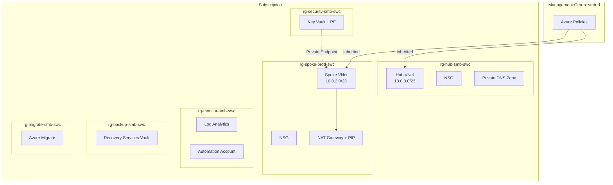

## Hub-Spoke Topology

All scenarios share the same hub-spoke foundation. The hub contains shared services (DNS, optionally Firewall and VPN Gateway). The spoke hosts production workloads. Azure Bastion Developer is available as a portal capability for browser-based VM access — no dedicated Bastion resource is deployed.

## Baseline

The simplest scenario — cloud-native with NAT Gateway for outbound internet. No hybrid connectivity, no centralized egress filtering.

**Resources**: Hub VNet + NSG, Spoke VNet + NSG + NAT Gateway + PIP, Private DNS Zone, Key Vault + PE, Log Analytics, Automation Account, Recovery Vault, Migrate Project.

**No peering** — hub and spoke are independent VNets.

## Firewall

Adds Azure Firewall for centralized egress control. All spoke traffic is routed through the firewall via UDR. NAT Gateway is removed (Firewall handles outbound).

**Additional resources**: Azure Firewall + Firewall Policy + 2 PIPs, Route Tables (spoke + gateway), Hub↔Spoke peering.

## VPN

Adds VPN Gateway for site-to-site connectivity to on-premises. Uses gateway transit through hub↔spoke peering. NAT Gateway provides outbound internet (no firewall).

**Additional resources**: VPN Gateway + PIP, Hub↔Spoke peering with gateway transit.

**Requires**: `ON_PREMISES_ADDRESS_SPACE` parameter.

## Full

Combines Firewall and VPN Gateway. Maximum protection with centralized egress and hybrid connectivity. All spoke and on-premises traffic routes through the firewall.

**Additional resources**: Azure Firewall + policy + PIPs, VPN Gateway + PIP, Route Tables, Hub↔Spoke peering with gateway transit.

## Resource Group Layout

All scenarios use the same 6 resource groups:

| Resource Group             | Contents                                                        | Scope      |
| -------------------------- | --------------------------------------------------------------- | ---------- |
| `rg-hub-smb-{region}`      | Hub VNet, NSG, DNS, Firewall*, VPN GW*, Route Tables\*              | Shared     |
| `rg-spoke-prod-{region}`   | Spoke VNet, NSG, NAT GW\*                                       | Workload   |
| `rg-monitor-smb-{region}`  | Log Analytics, Automation Account                               | Operations |
| `rg-backup-smb-{region}`   | Recovery Services Vault                                         | Backup     |
| `rg-security-smb-{region}` | Key Vault + Private Endpoint                                    | Security   |
| `rg-migrate-smb-{region}`  | Azure Migrate Project                                           | Migration  |

\*Conditional — depends on scenario.
